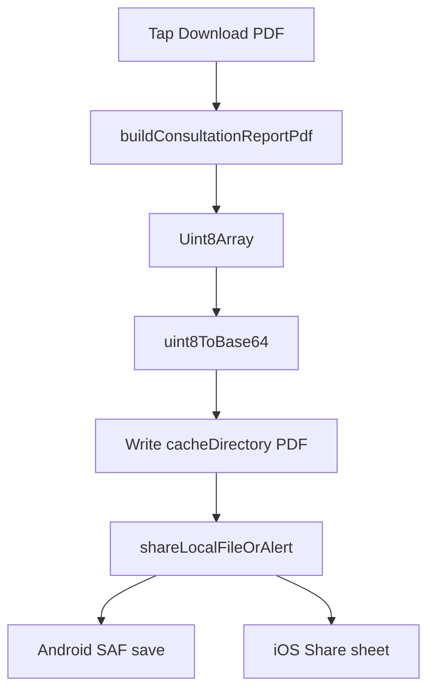
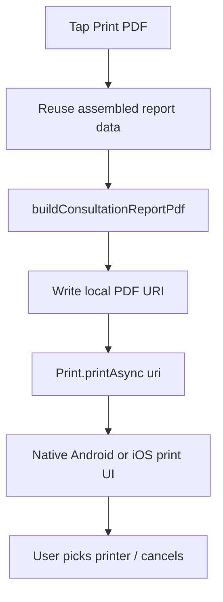

# Print PDF Feature — Analysis & Implementation Document

## Important correction vs. stated assumptions

The app does **not** generate PDFs from an HTML template. There is no HTML→PDF path, and `**expo-print` is not installed today\*\*.

| Assumption                        | Actual implementation                                                                     |
| --------------------------------- | ----------------------------------------------------------------------------------------- |
| HTML template created in-app      | **None** — layout is drawn with `pdf-lib` (`page.drawText` / rectangles / lines)          |
| HTML populated with data          | Typed object `ConsultationReportPdfInput` passed into the builder                         |
| Library: expo-print / html-to-pdf | `**pdf-lib` ^1.17.1\*_ (pure JS). Comment in code: _“Pure-JS PDF (no native ExpoPrint)”\* |
| After generate → download         | Bytes → base64 → write cache file → `shareLocalFileOrAlert` (Android SAF / iOS Share)     |

Print will still follow your required flow (reuse generation → get local URI → open native print dialog), using `**Print.printAsync({ uri })**` so we never introduce a second HTML/PDF pipeline.

---

## 1. Existing Download PDF — findings

### Screen / button

- Screen: `[src/app/(app)/patients/[id]/report.tsx](<src/app/(app)`/patients/[id]/report.tsx>) — `PatientAppointmentReportScreen`
- Entry: `[src/features/patients/sections/AppointmentsCard.tsx](src/features/patients/sections/AppointmentsCard.tsx)` navigates to `/patients/[id]/report`
- Button (~348–358): `label="Download PDF"` → `onDownloadPdf`

### Data population (not HTML)

Same fields feed the on-screen preview and the PDF builder:

- Facility: `useActiveFacility()`
- Patient: `usePatient(id)`
- Consult / summary / Rx: `useConsultation`, `useSummary`, `usePrescriptions`
- Assembled as `diagnosis`, `notes`, `prescriptionRows`, `patientName`, `doctorLabel`, `dateTimeLabel`, etc.

### PDF generation

- Function: `**buildConsultationReportPdf**` in `[src/features/patients/buildConsultationReportPdf.ts](src/features/patients/buildConsultationReportPdf.ts)`
- Returns: `Promise<Uint8Array>`
- Helper: `**uint8ToBase64**` for FileSystem writes
- Layout: US Letter (612×792), Helvetica, single page

### Save / download

- Temp file: `${FileSystem.cacheDirectory}prescription-{consultLabel}.pdf` via `expo-file-system/legacy`
- Persist/share: `[src/lib/api/shareLocalFile.ts](src/lib/api/shareLocalFile.ts)`
  - Android: Storage Access Framework folder pick + write
  - iOS: React Native `Share.share({ url })`

### Current flow



Relevant handler today:

```138:176:src/app/(app)/patients/[id]/report.tsx
  const onDownloadPdf = async () => {
    setDownloading(true);
    try {
      const bytes = await buildConsultationReportPdf({ /* ...data... */ });
      // write cache file...
      await shareLocalFileOrAlert(dest, { fileName: safeName, dialogTitle: "Download PDF" });
    } catch (e) {
      Alert.alert("Download failed", describeError(e));
    } finally {
      setDownloading(false);
    }
  };
```

---

## 2. Target Print PDF design (reuse, no duplication)

### Principles

- **Reuse** `buildConsultationReportPdf` — do not add HTML, do not call `Print.printToFileAsync({ html })` for generation.
- **Extract** the “build + write cache” steps into one shared helper so Download and Print share one code path.
- **Print** only adds `expo-print`’s `Print.printAsync({ uri })` against that cache URI.
- **Download** stays behaviorally identical (still ends in `shareLocalFileOrAlert`).

### Shared helper (new)

Add something like `writeConsultationReportPdfToCache(input)` next to the builder (e.g. in `[buildConsultationReportPdf.ts](src/features/patients/buildConsultationReportPdf.ts)` or a thin sibling module under `src/features/patients/`):

1. Call `buildConsultationReportPdf(input)`
2. Build safe filename `prescription-{consultLabel}.pdf`
3. Write base64 to `FileSystem.cacheDirectory`
4. Return `{ uri, fileName }`

Then:

| Action   | Steps                                          |
| -------- | ---------------------------------------------- |
| Download | `write…ToCache` → `shareLocalFileOrAlert(uri)` |
| Print    | `write…ToCache` → `Print.printAsync({ uri })`  |

No second template. No second generator. Filename/cache logic lives in one place (removes the duplication that would otherwise appear if Print copied `onDownloadPdf`).

### UI

In `[report.tsx](<src/app/(app)`/patients/[id]/report.tsx>), below Download PDF:

- Second button: **Print PDF** (`print-outline` icon)
- Separate `printing` loading state so Download and Print do not fight each other
- Disable both while either is in progress (or only the active one shows loading — match existing `Button` `loading` pattern)

### Print execution flow



---

## 3. Package & platform notes

### Install (Expo SDK 57)

```bash
npx expo install expo-print
```

Aligns `expo-print` with SDK 57 (docs: [Print — Expo SDK 57](https://docs.expo.dev/versions/v57.0.0/sdk/print/)).

### Config

- No `app.json` plugin is required for basic `printAsync({ uri })`.
- **Dev client / rebuild**: if the project uses a custom native build (not only Expo Go), rebuild after adding the native module so `expo-print` is linked.
- **Web**: `uri` printing is Android/iOS only; this report screen is a care tablet flow — no web print path needed unless you later add one.

### API usage

```ts
import * as Print from "expo-print";

await Print.printAsync({ uri }); // local file:// from cache
```

Do **not** pass both `html` and `uri`. Do **not** use `printToFileAsync` for this feature (that would be an alternate HTML→PDF generator).

### Platform behavior

| Case                                       | Behavior                                                                                           |
| ------------------------------------------ | -------------------------------------------------------------------------------------------------- |
| iOS cancel (close dialog without printing) | `printAsync` **rejects** — treat as cancel (no error alert, or soft message)                       |
| Android cancel                             | Promise often **resolves** when dialog opens; OS handles cancel — do not treat as failure          |
| No printer                                 | Native dialog shows empty/unavailable state — no app-level special case beyond leaving dialog open |
| Generation / cache write failure           | Same as download: `Alert.alert("Print failed", describeError(e))`                                  |
| Missing data                               | Existing placeholders (`—`, empty Rx) already handled by builder; same input object as Download    |
| Invalid HTML                               | N/A — no HTML path                                                                                 |

Detect cancel carefully (message/code from rejection) so real print errors still alert.

---

## 4. Files to change

| File                                                                                                                                          | Change                                                                  |
| --------------------------------------------------------------------------------------------------------------------------------------------- | ----------------------------------------------------------------------- |
| `[package.json](package.json)` / lockfile                                                                                                     | Add `expo-print` via `npx expo install`                                 |
| `[src/features/patients/buildConsultationReportPdf.ts](src/features/patients/buildConsultationReportPdf.ts)` (or small new helper next to it) | Export `writeConsultationReportPdfToCache` wrapping build + cache write |
| `[src/app/(app)/patients/[id]/report.tsx](<src/app/(app)`/patients/[id]/report.tsx>)                                                          | Refactor `onDownloadPdf` to use helper; add `onPrintPdf` + Print button |
| `[app.json](app.json)`                                                                                                                        | No change expected                                                      |

**Unchanged:** `[shareLocalFile.ts](src/lib/api/shareLocalFile.ts)`, PDF layout drawing inside `buildConsultationReportPdf`, backend APIs.

---

## 5. Explicit reuse answers (for your checklist)

| Question                         | Answer                                                                                                               |
| -------------------------------- | -------------------------------------------------------------------------------------------------------------------- |
| Existing HTML generation reused? | **N/A** — there is no HTML generation. Layout remains `pdf-lib`.                                                     |
| Existing PDF generation reused?  | **Yes** — same `buildConsultationReportPdf`.                                                                         |
| Code duplication removed?        | **Yes** — extract cache-write so Download/Print do not duplicate filename + FileSystem logic.                        |
| New helpers?                     | `**writeConsultationReportPdfToCache**` — single place for bytes → local URI; Print adds only the print dialog call. |

---

## 6. Edge-case handling (implementation checklist)

- PDF generation throws → alert “Print failed” / “Download failed”
- Cache directory missing → throw clear error (already present for download)
- File write fails → caught and alerted
- User cancels print (iOS) → swallow cancel; do not show failure alert
- No printer / OS errors → surface only non-cancel failures via `describeError`
- Concurrent taps → `printing` / `downloading` guards

---

## 7. Workflow summary (integration)

Download and Print share **one** PDF pipeline (`buildConsultationReportPdf` → cache URI). Download continues to hand that URI to `shareLocalFileOrAlert`. Print hands the same URI to `expo-print`’s native dialog. Download behavior and layout stay unchanged; Print is an additive action on the report screen.
