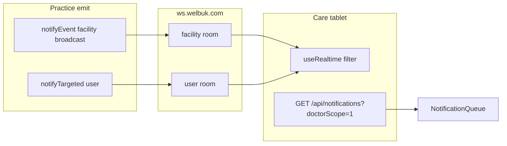

# Care doctor-only notifications — implementation guide

> **Status:** Implemented (Care client + Practice allowlist/persist).  
> **Goal:** Doctor-home logins on Welbuk Care toast and list only doctor-relevant notifications — not the full facility-admin feed.  
> **Companion:** Practice WS overview → [`WS_INTEGRATION.md`](../../practice/Welbuk_/docs/WS_INTEGRATION.md).

---

## Product rule

Doctor-home users get Practice **clinical** events (appointments / labs / Rx / referrals for their `doctorId`) **plus** Care coordination (`PATIENT_ASSIGNED`, `PATIENT_CALL_RAISED`) when targeted to them.

Facility admins and super admins keep the **full facility feed** (same as Practice).

**Doctor-home gate** (both apps):

```ts
Boolean(user.doctorId) && !isSuperAdmin && !isFacilityAdmin
```

Care: `isDoctorHome` in `src/lib/auth/roles.ts`.

---

## Architecture



| Layer | Doctor-home behaviour |
|-------|------------------------|
| Live toast | `isEventRelevantToViewer` — own `doctorId` / name match, or user-targeted Care events |
| Notification list | `doctorScope=1` — clinical allowlist + `isNotificationForDoctor` |
| Mark all read | `doctorScope=1` — only scoped unread clear |

---

## Event → audience matrix

| Event | Emit target | Doctor sees when |
|-------|-------------|------------------|
| `APPOINTMENT_*` | facility + `payload.doctorId` | doctorScope + live filter match |
| `APPOINTMENT_DOCTOR_CHANGED` | facility + `fromDoctorId` / `toDoctorId` | **only** from or to doctor (not other doctors at the clinic) |
| `APPOINTMENT_DOCTOR_LANE_TRANSFERRED` | facility + `fromDoctorId` / `toDoctorId` | **only** from or to doctor (CareLane bulk transfer) |
| `LAB_*` / `PRESCRIPTION_ISSUED` / `REFERRAL_*` | facility + ideally `doctorId` | same |
| `PATIENT_ASSIGNED` | `{ type: "user", userId }` | `targetUserId` / `staffUserId` match |
| `PATIENT_CALL_RAISED` | user if assigned, else facility | doctor: only user target; staff/admin: facility ok |
| Payment / QR / check-in / onboard | facility | **admin/staff only** |
| `DOCTOR_READY_FOR_NEXT` | facility | **staff/admin only** (front desk) |

Date/time **reschedule with the same doctor** does **not** emit these events. Changing the doctor (Change doctor, StepIn, or Transfer lane) does — Care toasts and refreshes `appointments` / `queue`.

Do **not** switch emits to role rooms for this fix — client/API scoping matches Practice design.

---

## File checklist

### Practice

| File | Change |
|------|--------|
| `lib/notifications/doctor-clinical-events.ts` | Add `PATIENT_ASSIGNED`, `PATIENT_CALL_RAISED` to `DOCTOR_CLINICAL_EVENTS` |
| `lib/notifications/notify.ts` | `notifyTargeted({ facilityId? })` so user targets persist with a real facility |
| `app/api/patient/assignment/route.ts` | Pass `facilityId` + `staffUserId` / `targetUserId` in payload |
| `app/api/patient/call/route.ts` | Pass `facilityId` + `assignedToUserId` / `targetUserId` when assigned |

List / read-all already honour `?doctorScope=1`.

### Care

| File | Change |
|------|--------|
| `src/lib/api/endpoints/notifications.ts` | `doctorScope` query on list + read-all |
| `src/features/notifications/hooks.ts` | `isDoctorHome` → scope; query key `["notifications", facilityId, "doctor" \| "facility"]` |
| `src/lib/realtime/events.ts` | Tighten CALL/ASSIGNED (user-target only); from/to filter for doctor-change + CareLane transfer |
| `src/lib/realtime/useRealtime.ts` | Invalidate scoped notifications key; no clinical toast/invalidate when filtered out; idempotency dedup |

---

## Non-goals

- No emit rewrite to role rooms
- FA / SA with a linked `doctorId` still get the **full** facility feed (`isDoctorHome` is false)
- Practice web live handlers for non-appointment facility events (payment, QR) — optional parity, out of Care scope

---

## Test plan

- [ ] Doctor A: toast + list only own appointments; no payment / QR / check-in rows
- [ ] Doctor B: does not see Doctor A’s bookings
- [ ] Facility admin / super admin on Care: full facility feed unchanged
- [ ] Raise call assigned to Doctor A: only A toasts/lists; unassigned facility raise: staff yes, doctors no
- [ ] Mark all read as doctor: only scoped unread clear
- [ ] Doctor who is also facility admin: full feed (by design)
- [ ] Doctor A → Doctor B change: A and B toast + queue refresh; Doctor C does not
- [ ] CareLane transfer A → B: one `APPOINTMENT_DOCTOR_LANE_TRANSFERRED` on A and B only
- [ ] Same-doctor reschedule: no doctor-change toast
