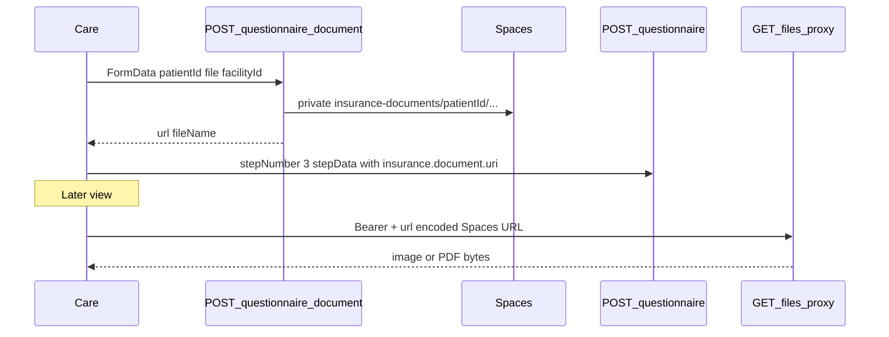

# Care Medical History — Implementation Guide

> **Status:** Analysis / implementation contract (source-traced).  
> **Sources traced:** Practice web Patient detail Medical History card + 3-step questionnaire, questionnaire/document upload, files proxy.  
> **Goal:** Replicate Practice **Medical History** on Welbuk Care (Expo tablet) using the **same Practice APIs**, permissions, JSON shapes, and insurance upload/view flow.  
> **Companion:** Patient module overview → [`CARE_PATIENT_MODULE_IMPLEMENTATION.md`](./CARE_PATIENT_MODULE_IMPLEMENTATION.md). Style peer → Practice [`TABLET_APPOINTMENT_LIST_IMPLEMENTATION.md`](../../practice/Welbuk_/docs/TABLET_APPOINTMENT_LIST_IMPLEMENTATION.md).

**No Practice API/schema changes.** Care must not invent new JSON keys or parallel backends.

**Care today:** Patient detail already wires `MedicalHistoryCard` + `QuestionnaireSheet` (`src/features/patients/…`, `src/lib/api/endpoints/questionnaire.ts`). Use this doc as the parity checklist and API contract.

---

## Source of truth (do not invent behaviour)

| Layer | Path (Practice `practice/Welbuk_/`) |
|--------|------|
| Detail card | `components/patient/details/sections/MedicalHistoryCard.tsx` |
| 3-step wizard | `components/patient/questionnaire/questionnaire-sheet.tsx` |
| Questionnaire CRUD | `app/api/patient/questionnaire/route.ts` |
| Insurance file upload | `app/api/patient/questionnaire/document/route.ts` |
| Display helper | `lib/utils/file-display-url.ts` → `/api/files/proxy?url=` |
| Proxy allowlist | `lib/files/proxy-file.ts` (`insurance-documents/`) |
| Optional consult chart | `app/api/consult/patient-history/route.ts` |
| Care (scaffolding) | `welbuk-care/src/features/patients/QuestionnaireSheet.tsx`, `MedicalHistoryCard.tsx`, `lib/api/endpoints/questionnaire.ts` |

**Auth for tablet:** `Authorization: Bearer <staffJWT>` (same token as Care login). Prefer Bearer over cookie; Practice guards accept both.

**Always send `facilityId`** (query and/or body). After the tenancy fix, GET/POST questionnaire return `400 Facility ID is required` when omitted.

---

## 1. Product concept — what “Medical History” means

Practice’s patient-detail **Medical History** is the **3-step Patient Questionnaire**, **not** the discrete `MedicalHistory` condition-row CRUD (`/api/patient/medical-history`) or medications CRUD (`/api/patient/medications`). Those routes exist but have **no** web Medical History UI.

| Step | UI label | Stored on `PatientQuestionnaire` |
|------|----------|----------------------------------|
| 1 | Past medical history | `medicalHistory` (conditions, surgeries, hospitalizations) |
| 2 | Medications & allergies | `allergies` + `CurrentMedications` |
| 3 | Insurance (+ family UI) | `medicalHistory` again, merged with `insurance` |

`lifestyle` is always written as `null` by the API. `currentStep` is set to the saved `stepNumber`.

### Insurance card (end-to-end)

There is **no** `PatientInsurance` Prisma model. Insurance lives inside questionnaire JSON.

1. Staff picks **Yes** → type / name / valid-till → picks image or PDF.
2. **Upload first** via `POST /api/patient/questionnaire/document` → private Spaces URL (folder `insurance-documents/`, not public).
3. That URL is saved **inside** questionnaire JSON as `medicalHistory.insurance.document.uri` on step-3 POST.
4. **View** always goes through authenticated **`GET /api/files/proxy?url=…`** (PHI). Never open the raw Spaces URL in a WebView / browser without Bearer.



On Care, prefer `fetchProxiedFileToCache` (`src/lib/api/fetchProxiedFile.ts`) — download with Bearer into cache, then open the **local** URI. Do not load the proxy URL in an unauthenticated WebView.

---

## 2. Screen tree (tablet)

```
PatientDetail
├── MedicalHistoryCard          // read summary from GET questionnaire
│   └── Add / Edit → opens sheet
└── QuestionnaireSheet (modal)
    ├── Stepper (1–3)
    ├── Step1 PastMedicalHistory
    │   ├── Condition chips (+ optional YYYY-MM dates)
    │   ├── Other condition (+ date)
    │   ├── Surgeries Yes/No + details
    │   └── Hospitalizations Yes/No + details
    ├── Step2 MedicationsAllergies
    │   ├── Taking meds Yes/No + details
    │   ├── Herbal/Ayurvedic Yes/No + details
    │   ├── Medicine allergies Yes/No + details
    │   └── Food allergies Yes/No + details
    └── Step3 Insurance
        ├── Has insurance Yes/No
        ├── Type: Government | Private | Other
        ├── Name lists (static) / Other free text
        ├── Valid till
        ├── Upload insurance doc (required when Yes on web)
        └── Preview via files proxy
```

| Component | Responsibility |
|-----------|----------------|
| **MedicalHistoryCard** | Load `GET` questionnaire; summarize past conditions, allergies, meds, insurance; Add/Edit |
| **QuestionnaireSheet** | 3-step wizard; hydrate from existing; POST per step; upload doc before step-3 save |
| **Insurance upload row** | Document picker → `questionnaire/document` → keep `{ url, fileName }` in local state |
| **Insurance preview** | `fetchProxiedFileToCache(document.uri)` → Image / PDF viewer |

Wire on Care: `src/app/(app)/patients/[id]/index.tsx` (already opens sheet with `patientId` = route/display id, `mongoPatientId` for upload).

---

## 3. Auth & permissions

| Action | Permission |
|--------|------------|
| Read questionnaire / card | `patient.read` via `requireSectionAccess(..., "patient", "read", facilityId)` |
| Save step / complete | `requireAnyPermission(["patient.create", "patient.write", "patient.update"], facilityId)` |
| Upload insurance document | Same `requireAnyPermission` set (staff path) |

**Note:** `patient.update` is still checked by these routes even though it may be absent from the default permission catalog — same gap as elsewhere in the Patient module. Care should send whatever write permission the staff role actually has; Practice accepts any of the three.

Headers (Care):

```
Authorization: Bearer <staffJWT>
Content-Type: application/json   // JSON POSTs only
```

Multipart uploads: do **not** set `Content-Type` manually (boundary must be set by the client).

---

## 4. API reference

### 4.1 `GET /api/patient/questionnaire`

| Item | Detail |
|------|--------|
| **File** | `app/api/patient/questionnaire/route.ts` |
| **Auth** | Bearer (or cookie) + `patient.read` |
| **Query** | `patientId` (Mongo `id` **or** display numeric `patientId`) **and** `facilityId` (**required**) |
| **Access** | `assertPatientFacilityAccess` after section access |
| **Response** | `{ questionnaire }` — may be `null` if none yet |
| **Errors** | `400` missing facility/patientId · `401` · `403` · `404` patient · `500` |

Care: treat missing questionnaire like empty chart (card shows “No questionnaire on file”). A bare `404` on patient is an error; some older clients also treated questionnaire miss as null — current GET returns `200` with `questionnaire: null` when the patient exists.

**Care client:** `getPatientQuestionnaire(patientId, facilityId)` → `src/lib/api/endpoints/questionnaire.ts`. Query key: `["patient-questionnaire", patientId, facilityId]`.

---

### 4.2 `POST /api/patient/questionnaire`

| Item | Detail |
|------|--------|
| **File** | Same route file |
| **Auth** | Bearer + any of `patient.create` \| `patient.write` \| `patient.update` |
| **Body** | See below |
| **facilityId** | **Required** — body `facilityId` and/or header/`extractFacilityIdFromRequest`. Do **not** derive from the target patient’s facility. |
| **Response** | `{ success, questionnaire, message }` |
| **Errors** | `400` missing facility/patient/step · `401` · `403` · `404` access · `500` |

#### Request body

```ts
{
  patientId: string;       // Mongo or display id (resolved via assertPatientFacilityAccess)
  facilityId: string;      // required
  stepNumber: 1 | 2 | 3;
  stepData: object;        // shapes below
  completed?: boolean;     // true on final finish (message only; persistence is still step fields)
}
```

#### Step → persisted columns

| `stepNumber` | Written fields |
|--------------|----------------|
| 1 | `medicalHistory = stepData` (**full replace**) |
| 2 | `allergies = stepData.allergies`, `CurrentMedications = stepData.CurrentMedications` |
| 3 | `medicalHistory = stepData` (**full replace** — must include step-1 fields + `insurance`) |

Also always: `lifestyle: null`, `currentStep: stepNumber`.

**Critical:** Step 3 overwrites the entire `medicalHistory` document. Care **must** merge step-1 fields + insurance (web: `toMedicalHistoryPayload(step1Data, step3Data)`; Care today: spread prior `medicalHistory` then set `insurance`). Saving only `{ insurance: … }` on step 3 **wipes** conditions/surgeries/hospitalizations.

Likewise, step 1 replace **drops** existing `insurance` until step 3 is saved again (same as web).

---

### 4.3 Step payloads (exact shapes)

Mirror `toMedicalHistoryPayload` / `toAllergiesPayload` / `toCurrentMedicationsPayload` in `questionnaire-sheet.tsx`. Do not invent keys.

#### Step 1 → `medicalHistory`

```jsonc
{
  "pastConditions": {
    "selectedValue": ["Diabetes", "Asthma"],
    "inputValue": "",                    // “Other” free text
    "conditionDates": { "Diabetes": "YYYY-MM" },
    "otherConditionDate": ""             // YYYY-MM for Other
  },
  "surgeries": {
    "selectedValue": "Yes" | "No" | "",
    "inputValue": ""
  },
  "hospitalizations": {
    "selectedValue": "Yes" | "No" | "",
    "inputValue": ""
  }
}
```

**Preset condition chips (static):**

- Diabetes  
- High Blood Pressure  
- Heart Disease  
- Asthma  
- Tuberculosis  
- Thyroid Problems  
- Kidney Disease  
- Cancer  
- Mental Health Issues  

#### Step 2 → wrapper object

```jsonc
{
  "allergies": {
    "medicineAllergies": { "selectedValue": "Yes" | "No", "inputValue": "" },
    "foodAllergies": { "selectedValue": "Yes" | "No", "inputValue": "" },
    "otherAllergies": { "selectedValue": "No", "inputValue": "" }
  },
  "CurrentMedications": {
    "medications": { "selectedValue": "Yes" | "No", "inputValue": "" },
    "herbal&ayurvedic": { "selectedValue": "Yes" | "No", "inputValue": "" },
    "otherMedicationsDetails": { "selectedValue": "No", "inputValue": "" }
  }
}
```

Web joins up to three medicine name chips into `medications.inputValue` as a comma-separated string. Care may use a single text field with the same string shape.

#### Step 3 → full `medicalHistory` (step-1 fields **+** insurance)

```jsonc
{
  "pastConditions": { /* same as step 1 */ },
  "surgeries": { /* same as step 1 */ },
  "hospitalizations": { /* same as step 1 */ },
  "insurance": {
    "hasInsurance": "Yes" | "No",
    "type": "Government Insurance" | "Private Insurance" | "<Other label>",
    "insuranceName": "",
    "insuranceNameOther": "",
    "validTill": "YYYY-MM-DD" | null,
    "document": {
      "uri": "https://…/insurance-documents/<patientId>/…",
      "name": "card.pdf",
      "size": 0
    }
  }
}
```

**Type mapping (UI → stored `type` string):**

| UI value | Stored `type` |
|----------|----------------|
| `government` | `Government Insurance` |
| `private` | `Private Insurance` |
| `other` | free text (`otherInsuranceType`) or `"Other"` |

**Static government names:**

- CMCHIS (Chief Minister's Comprehensive Health Insurance Scheme)  
- ESI (Employees' State Insurance)  
- CGHS (Central Government Health Scheme)  
- ECHS (Ex-Servicemen Contributory Health Scheme)  
- Arogya Karnataka  
- Ayushman Bharat - Pradhan Mantri Jan Arogya Yojana (PM-JAY)  
- Other  

**Static private names:**

- Bharati AXA General Insurance  
- Bajaj Allianz General Insurance  
- HDFC ERGO General Insurance  
- ICICI Lombard General Insurance  
- New India Assurance  
- Oriental Insurance  
- Reliance General Insurance  
- Star Health and Allied Insurance  
- United India Insurance  
- Other  

**Web validation when `hasInsurance === Yes`:** type, name, and **document** are required. Care should match (document optional today is a parity gap).

**Family history:** Step 3 UI historically collected `familyHistory` chips, but that block is **commented out** on web and **not** persisted into `medicalHistory` by `toMedicalHistoryPayload`. Do not invent a Care-only family-history API field expecting it to round-trip.

---

### 4.4 `POST /api/patient/questionnaire/document`

| Item | Detail |
|------|--------|
| **File** | `app/api/patient/questionnaire/document/route.ts` |
| **Auth** | Staff Bearer + `requireAnyPermission` (create/write/update); mobile patient JWT also accepted on Practice (Care uses staff) |
| **Content** | `multipart/form-data` |
| **Fields** | `patientId` (**Mongo `id` only**), `file`, optional `facilityId` |
| **MIME** | `image/jpeg`, `image/jpg`, `image/png`, `image/gif`, `application/pdf` |
| **Max size** | **300 MB** |
| **Storage** | Private Spaces folder `insurance-documents` with `spacesSubPath = patientId` |
| **Response** | `{ url, fileName }` |
| **Errors** | `400` validation · `401` · `403` · `404` patient · `503` upload failure · `500` |

Upload **before** step-3 POST. Put returned `url` into `insurance.document.uri` and picker name into `document.name` (`size` may be `0` as on web).

**Care client:** `uploadQuestionnaireDocument({ patientId: mongoId, uri, fileName, mimeType, facilityId })`.

---

### 4.5 `GET /api/files/proxy?url=`

| Item | Detail |
|------|--------|
| **File** | `app/api/files/proxy/route.ts` → `lib/files/proxy-file.ts` |
| **Auth** | Staff Bearer (Care) |
| **Query** | `url` = absolute encoded Spaces (or allowed local) URL |
| **Allowlist** | Includes `insurance-documents/` (and `uploads/insurance-documents/`) |
| **Use** | View/download insurance card after save |

Web: `fileDisplayUrl(url)` builds `/api/files/proxy?url=${encodeURIComponent(absolute)}`.  
Care: `fileProxyUrl` + `fetchProxiedFileToCache` — never open Spaces URL raw.

---

### 4.6 Optional read-only — `GET /api/consult/patient-history`

| Item | Detail |
|------|--------|
| **File** | `app/api/consult/patient-history/route.ts` |
| **Query** | `patientId`, **`facilityId` (required)**, optional `consultationId` |
| **Purpose** | Consult “prior history” panel — merges questionnaire + other chart tables |
| **Care Medical History card** | **Not required** for Patient chart parity; questionnaire GET is enough |

---

## 5. Design notes for Care parity

1. **Mirror web sections** — condition chips, Yes/No + details, insurance type/name lists, required document when Yes.  
2. **Touch-friendly stepper** — large Continue / Back; show “Step N of 3 — {title}”.  
3. **Do not invent JSON keys** — keep `selectedValue` / `inputValue` / `herbal&ayurvedic` / `document.uri`.  
4. **facilityId on every call** — GET, POST, and document FormData.  
5. **Mongo id for upload** — document route looks up `Patient.id`; display numeric id will 404.  
6. **Preserve insurance on re-edit** — when finishing step 3 without a new file, keep existing `document` from hydrated questionnaire (Care currently clears local `docUri` on open — must re-send prior `document` if present).  
7. **Invalidate** `["patient-questionnaire", …]` after successful saves so the card refreshes.

---

## 6. Related APIs — do **not** use for this card

| Route | Why unused |
|-------|------------|
| `GET/POST/PUT/DELETE /api/patient/medical-history` | Discrete condition rows; **no** web Medical History UI |
| `GET/POST/… /api/patient/medications` | Meds live in questionnaire `CurrentMedications` |
| `/api/mobile/patient-questionaries` | Patient mobile JWT flow — **not** staff Care |

Document these only so Care does not confuse them with chart Medical History.

---

## 7. Out of scope / pitfalls

| Pitfall | Detail |
|---------|--------|
| Step 3 overwrite | Must merge step-1 MH + insurance; bare insurance object deletes history |
| Step 1 wipe | Step 1 POST replaces MH and drops insurance until step 3 |
| Family history | Collected historically in UI; **not persisted** today |
| Raw Spaces URL | PHI; always proxy with Bearer |
| Missing `facilityId` | `400` after tenancy fix |
| Wrong patient id on upload | Must be Mongo `_id` |
| Mobile questionnaire path | Wrong auth model for staff tablet |
| Discrete MH / med APIs | Not the Practice Medical History card |

---

## 8. Care implementation checklist

- [x] Thin clients: `getPatientQuestionnaire`, `savePatientQuestionnaire`, `uploadQuestionnaireDocument`
- [x] Hooks + query keys with `facilityId` (GET enabled only when facility selected)
- [x] `MedicalHistoryCard` summary on patient detail
- [x] `QuestionnaireSheet` 3-step save flow
- [x] Gov/private insurance name lists + type segmented control
- [x] Require insurance document when Yes
- [x] Re-attach existing `document` on step-3 save when user does not re-upload
- [x] View insurance card via `fetchProxiedFileToCache` from card and step 3
- [x] Yes/No segmented for surgeries/hospitalizations
- [ ] Optional: condition `YYYY-MM` date pickers

---

## 9. Quick reference — Care files

| Concern | Path |
|---------|------|
| Detail screen | `src/app/(app)/patients/[id]/index.tsx` |
| Read card | `src/features/patients/sections/MedicalHistoryCard.tsx` |
| Wizard | `src/features/patients/QuestionnaireSheet.tsx` |
| Types | `src/features/patients/types.ts` |
| Hooks | `src/features/patients/hooks.ts` |
| API | `src/lib/api/endpoints/questionnaire.ts` |
| Proxy download | `src/lib/api/fetchProxiedFile.ts` |
