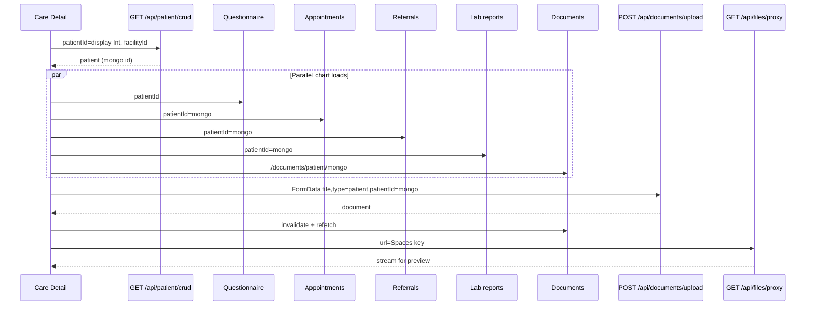

# Care Patient Module — Implementation Contract

Status: **source-traced** (Practice web Patient UI + APIs as of 2026-07). Same style as Practice [`VOICE_SCRIBE_INTEGRATION.md`](../../practice/Welbuk_/docs/VOICE_SCRIBE_INTEGRATION.md). Canonical copy also in Practice `docs/CARE_PATIENT_MODULE_IMPLEMENTATION.md`.

> Care is a **staff Bearer JWT** client of the same Practice routes the web app uses (`credentials: "include"` on web → `Authorization: Bearer <staffJWT>` on tablet after `POST /api/auth/login`).
>
> **No Practice API/schema changes** in this phase. Do not invent backends. Gaps are listed in §14.
>
> **Taxonomy:** Lab report ≠ Patient document ≠ Visit file ≠ `PatientRecording`. Full file-flow matrix lives in Practice [`.cursor/plans/care_lab_reports_docs_aaf17f90.plan.md`](../../practice/Welbuk_/.cursor/plans/care_lab_reports_docs_aaf17f90.plan.md) — this guide covers Patient chart parity and only summarizes documents/labs as used by the Patient module.

Practice source roots cited below are under sibling repo `practice/Welbuk_/`.

---

## 1. Module Overview

### Purpose

Facility-scoped **patient registry + chart**: search/list, create/edit, facility unlink (soft), demographics, questionnaire-backed medical history / allergies / meds / insurance, appointments, referrals, lab reports, and patient documents (list/view; upload in-module on Care).

### Navigation (web sidebar → Care)

Patient is a **single top-level item**, not a submenu (`components/dashboard/app-sidebar.tsx`):

| Nav | Href | Gates |
|-----|------|--------|
| Patients | `/patient` | `patient.read` **and** plan feature `patients` (`lib/entitlements/nav-features.ts`) |

Sidebar **Documents** (`/documents`) is **commented out** in the web sidebar; the page and `POST /api/documents/upload` still exist. Care should expose upload on the detail **Documents** card (in-module), calling the same upload API.

Layout gate (web): `app/(dashboard)/patient/layout.tsx` → `SectionAccessGate resource="patient"`.

### Roles / permissions (catalog)

From `lib/permissions/default-permissions.ts` — keys that exist:

| Key | Meaning |
|-----|---------|
| `patient.read` | View list/detail |
| `patient.create` | Create |
| `patient.write` | Edit demographics |
| `patient.manage` | Edit protected DOB (without ABHA governance path) |
| `patient.assign` | Care assignments (Appendix — not chart parity) |
| `patient.delete` | Facility unlink |

**There is no `patient.update` in `ALL_PERMISSIONS`.** Several routes still call `requireSectionAccess(..., "update")` → key `patient.update`. Documented in §9 / §14.

### Product rules (do not invent)

- **Soft facility unlink only** on DELETE crud — clears `FacilityPatient` (`active=false`, `isDeleted=true`); does **not** set `Patient.isDeleted`.
- **Consent** required (`consentGiven === true`) on create/update.
- **ABHA** uniqueness is **per facility**; governed ABHA fields can return `409 ABHA_GOVERNED_FIELD`.
- **Minors** (&lt;18): `parentOrGuardianName` required on create.
- **Family**: `Patient.primaryPatientId` / `relationshipToPrimary` — no separate EmergencyContact model.
- **Insurance**: questionnaire JSON + `insurance-documents/` uploads — no `PatientInsurance` Prisma model.
- Tenancy via `FacilityPatient` + staff facility membership / `PatientDoctor` for access checks.

### Dependencies

Active `facilityId`, permissions API / section access, plan entitlements `patients`, ABHA site/facility toggles (where UI locks fields), Spaces + `GET /api/files/proxy`, authenticated multipart upload.

---

## 2. Module Architecture

### Screen hierarchy (recommended Care)

```
Stack
├── PatientList
├── PatientDetail          // route param = display patientId (Int) like web
├── PatientOnboard         // optional parity
├── DocumentUpload         // sheet/modal (or inline on Documents card)
└── Modals/Sheets
    ├── CreateEditPatient
    ├── DeleteUnlinkConfirm
    ├── Questionnaire (3 steps)
    ├── LabReportUpload
    └── DocumentPreview
```

Web → Care map:

| Web route | Care screen | Primary Practice components |
|-----------|-------------|----------------------------|
| `/patient` | List | `search/list.tsx`, `create-patient.tsx`, `patient-form.tsx`, `delete-patient-dialog.tsx` |
| `/patient/[patientId]` | Detail | `details/home.tsx` + section cards |
| `/patient/onboard` | Onboard | `onboarding/patient-onboarding-flow.tsx` |
| `/patient/link/[code]` | Deep link → Detail | parse → navigate with display id |
| `/documents` | Document Management / upload sheet | `documents/page.tsx` |

### State

No patient Zustand store on web. Care should mirror **TanStack Query** keys:

| Key | Source |
|-----|--------|
| `["patients", facilityId, search]` | List infinite query |
| `["patient", id, facilityId]` | Crud GET |
| `["patient-questionnaire", patientId]` | Questionnaire GET |
| `["patient-documents", mongoId, page]` | Documents list |
| `["patient-lab-reports", mongoId]` | Lab reports |
| `["patient-appointments", mongoId, facilityId]` | Appointments |
| `["patient-referrals", mongoId, facilityId, mode]` | Referrals |

Plus active `facilityId` from auth/locale store (Care already uses `useFacilityId`).

### API layer

Thin typed clients against Practice absolute base URL with:

```
Authorization: Bearer <staffJWT>
```

Pass `facilityId` in query/body wherever section access or tenancy requires it (same as web).

Existing Care scaffolding: `src/features/patients/*`, `src/lib/api/endpoints/patients.ts`, `src/lib/api/endpoints/documents.ts` — extend; do not invent parallel paths.

---

## 3. Patient Screens

### 3.1 List (`/patient`)

- **Purpose:** Server-paginated search; create; open detail; unlink.
- **APIs:** `POST /api/patient/search`; create via `POST /api/patient/crud`; unlink `DELETE /api/patient/crud`.
- **Nav:** Row → detail using **display** `patientId` (`/patient/${row.patientId}` on web — `components/patient/search/columns.tsx`).
- **Validations:** Facility selected; `patient.read` (+ plan `patients`).

### 3.2 Detail (`/patient/[patientId]`)

Orchestrator: `components/patient/details/home.tsx`.

Load order:

1. `GET /api/patient/crud?patientId=<displayOrMongo>&facilityId=` → `data.patient` (includes Mongo `id`).
2. Parallel (when `data.id` present):
   - Questionnaire: `GET /api/patient/questionnaire?patientId=<routeId>` (404 → treat as empty)
   - Appointments: `GET /api/facility/appointments?patientId=<mongo>&page&pageSize&facilityId?`
   - Referrals: `GET /api/referral?facilityId&patientId=<mongo>&mode=incoming|outgoing`
   - Labs: `GET /api/patient/lab-reports?patientId=<mongo>`
   - Documents: `GET /api/documents/patient/<mongo>?page=1&pageSize=10`
   - Dental plan column: `POST /api/consult/search` then `GET /api/consult/dental?consultationId=`

**Section cards (web order):** Header → Appointments → Medical History → Referrals + Labs + Documents.

### 3.3 Create / Edit

- Form: `patient-form.tsx` / Care `PatientForm.tsx`.
- Create: `POST /api/patient/crud` — requires `patient.create`, `consentGiven: true`, `firstName`; guardian if minor.
- Edit: `PUT /api/patient/crud` — requires `patient.write`; DOB changes may need `patient.manage`; ABHA locks possible.

### 3.4 Delete (facility unlink)

- Dialog: `delete-patient-dialog.tsx`.
- Body: `{ id: <mongoPatientId>, facilityId }`.
- Gate: `patient.delete` (web UI also restricts to facility/super admin JWT role).

### 3.5 Questionnaire

- Sheet: 3 steps — Past Medical History → Medications & Allergies → Family History & Insurance (`questionnaire-sheet.tsx`).
- Save: `POST /api/patient/questionnaire` per step; insurance file: `POST /api/patient/questionnaire/document`.
- **Not** `/api/patient/medical-history` or `/api/patient/medications` (those APIs exist but are **unused** by Patient UI).

### 3.6 Onboard

- Staff flow: `/patient/onboard` → `POST /api/patient/onboard` (+ lookup / verify-phone / check-in as needed).
- Rate limit on create route: 15/min/IP.

### 3.7 Documents upload

- Web page `/documents` only for staff upload; detail DocumentsCard is **view-only**.
- Care: add upload control on Documents card → same `POST /api/documents/upload`.

### 3.8 Link redirect

- `/patient/link/[code]` → resolve → navigate to detail with display id. Avoid putting PHI in QR payloads (share link/QR only).

---

## 4. API Documentation

All guards already honor Bearer JWT (same token as web cookie). Cite route files under Practice `app/api/…`.

### Auth header (Care)

```
Authorization: Bearer <staffJWT>
Content-Type: application/json   // or multipart FormData (no manual Content-Type)
```

---

### 4.1 `POST /api/patient/search`

**File:** `app/api/patient/search/route.ts`  
**Auth:** JWT only (no `requireSectionAccess`).

**Body**

```jsonc
{
  "page": 1,
  "pageSize": 20,
  "search": "",
  "sortBy": "createdAt",          // default
  "sortOrder": "desc",            // "asc" | "desc"
  "facilityId": "<facility ObjectId>",
  "includeExternal": false,
  "filters": {
    "name": "",
    "firstName": "",
    "lastName": "",
    "email": "",
    "phone": "",
    "abhaNumber": "",
    "patientId": "",
    "dob": "",
    "gender": ""
  }
}
```

**Response:** `{ patients, count, totalCount, totalPages, currentPage, pageSize }` (+ optional `externalPatients`).

**Patient select fields:** `id`, `patientId`, `firstName`, `lastName`, `dob`, `gender`, `phone`, `email`, `abhaNumber`, `isPhoneVerified`, `isWhatsAppNumber`, `address`, `bloodGroup`, `parentOrGuardianName`, `primaryPatientId`, `relationshipToPrimary`.

**Errors:** `401`, `403` facility, `500`.

---

### 4.2 `GET /api/patient/crud`

**File:** `app/api/patient/crud/route.ts`  
**Guard:** `requireSectionAccess(..., "patient", "read", facilityId?)`.

**Query:** `patientId` **or** `id` (required). 24-char hex → Mongo `Patient.id`; else numeric → `Patient.patientId`. Optional `facilityId`.

**Access:** Patient must be linked via `PatientDoctor` or active `FacilityPatient`, else only `SUPER_ADMIN`.

**Response:** `{ patient }` (may include `primaryPatient`, wrapper link fields).

**Errors:** `400` missing/invalid ID · `401` · `403` · `404` · `500`.

---

### 4.3 `POST /api/patient/crud` (create)

**Guard:** `patient` + `"create"`.

**Body fields used:** `facilityId`, `firstName` (req), `lastName`, `dob`, `parentOrGuardianName` (req if age &lt; 18), `gender`, `mobile`, `email`, `abhaNumber`, `address`, `consentGiven` (**must be `true`**), `isWhatsAppNumber`, `isDobEstimated`, `primaryPatientId`, `relationshipToPrimary`, `isPhoneVerified`, `registrationDate`, `active`.

**Side effects:** Allocates display `patientId` (from last+1, base ~10000); PIN = bcrypt(last 4 of mobile); `FacilityPatient` link; optional `PatientDoctor`; async wrapper link.

**Response:** `{ message, patientId, patient, facilityPatient }`.

**Errors:** `400` validation · `401` · `403` · `409` ABHA in facility · `500` `{ error, details }`.

---

### 4.4 `PUT /api/patient/crud` (update)

**Guard:** `patient` + **`"write"`** (not `update`).

**Body:** `id` (Mongo or display — resolved server-side), `facilityId`, demographics as create + `bloodGroup`; `consentGiven: true` required.

**Extra codes:** `409` ABHA/phone duplicate · `409` `ABHA_GOVERNED_FIELD` · `403` `PATIENT_MANAGE_REQUIRED` (DOB without `patient.manage`).

**Response:** `{ message, patient }`.

---

### 4.5 `DELETE /api/patient/crud` (facility unlink)

**Guard:** JWT + `patient` + `"delete"`.

**Body:** `{ "id": "<mongoPatientId>", "facilityId": "<facility ObjectId>" }`.

**Behavior:** Soft-remove `FacilityPatient` only — **does not** delete the patient row.

**Response:** `{ success: true, message: "Patient removed from this facility" }`.

**Errors:** `400` missing id/facilityId · `401` · `403` · `404` link missing · `500`.

---

### 4.6 Questionnaire

#### `GET /api/patient/questionnaire`

**File:** `app/api/patient/questionnaire/route.ts`  
**Guard:** `patient` + `"read"`.  
**Query:** `patientId` (Mongo or display).  
**Response:** `{ questionnaire }` (may be null). `404` patient.

#### `POST /api/patient/questionnaire`

**Auth:** JWT + `requireAnyPermission(["patient.create", "patient.write", "patient.update"], facilityId)`.

**Body:** `{ patientId, stepNumber: 1|2|3, stepData, completed?: boolean, facilityId? }`.

**Step mapping:**

| stepNumber | Persisted fields |
|------------|------------------|
| 1 | `medicalHistory = stepData` |
| 2 | `allergies = stepData.allergies`, `CurrentMedications = stepData.CurrentMedications` |
| 3 | `medicalHistory = stepData` (insurance merged into medicalHistory by UI) |

Also sets `lifestyle: null`, `currentStep: stepNumber`.

**Response:** `{ success, questionnaire, message }`.

#### `POST /api/patient/questionnaire/document`

**File:** `app/api/patient/questionnaire/document/route.ts`  
**FormData:** `patientId` (Mongo), `file`, optional `facilityId`.  
**MIME:** jpeg/jpg/png/gif, pdf; max **300 MB**. Folder: `insurance-documents`.  
**Staff perms:** same `requireAnyPermission` as questionnaire POST.  
**Response:** `{ url, fileName }`.

---

### 4.7 Lab reports

**File:** `app/api/patient/lab-reports/route.ts`

| Method | Guard action | Notes |
|--------|--------------|-------|
| GET | `read` | Query `patientId` — **Mongo `id` only** on lookup. Response `{ labReports }`. |
| POST | **`update`** | FormData: `patientId`, `date`, `test`, `status`, `notes?`, **`fileUrl` required** (from `/api/upload`). `201` `{ message, labReport }`. |
| PUT | **`update`** | FormData: `id`, `patientId`, `date`, `test`, `status`, `notes?`, optional file/`fileUrl`. |
| DELETE | `delete` | JSON: `id?`, `fileUrl?`, `patientId?`, `consultationId?`. Soft-delete. |

**Upload bytes first:**

```
POST /api/upload
FormData: purpose=patient_lab_report, patientId, facilityId, file
→ { urls, files: [{ url, fileName, fileType, fileSize, … }] }
```

Purpose auth uses **`patient.update`** (`lib/uploads/auth.ts`) — known gap vs catalog `patient.write` (§14).

---

### 4.8 Documents

#### `GET /api/documents/patient/[patientId]`

**File:** `app/api/documents/patient/[patientId]/route.ts`  
**Auth:** JWT + `checkStaffPatientAccess`.  
**Path param:** **Mongo id only**.  
**Query:** `page` (default 1), `pageSize` (default 20, max 100).

**Response:** `{ patient: { id, patientId, firstName, lastName }, documents: [...], pagination }`.

Document fields (serializer): `id`, `patientDocumentId`, `url`, `viewUrl`, `fileName`, `displayName`, `fileType`, `fileSize`, `createdAt`, `uploadedByPatient`, plus `uploadedBy`, `linkedAt`.

#### `POST /api/documents/upload`

**File:** `app/api/documents/upload/route.ts`  
**FormData:** `file`, `type` (`"patient"` \| `"facility"`), `patientId` \| `facilityId`.  
**MIME:** jpeg, png, pdf, doc, docx; **magic-byte check**; **10 MB**. Private Spaces + AES256.  
**Auth:** JWT + `checkStaffPatientAccess` / `checkFacilityAccess` — **does not** use `requireSectionAccess`.  
**Response `201`:** `{ message, document: { id, url, fileName, fileType, fileSize } }`.

**Prefer this path for Care patient docs** (matches web `/documents` page; avoids `patient.update` gap on `/api/upload` purpose `patient_document`).

---

### 4.9 `GET /api/files/proxy?url=`

**File:** `app/api/files/proxy/route.ts` → `lib/files/proxy-file.ts`  
Streams private Spaces / local uploads. Allowlist includes `lab-reports/`, `insurance-documents/`, patient-documents path, `report-attachments/`, etc.  
**Auth:** staff JWT (or mobile patient for own docs — Care uses staff).  
**Errors:** `400` missing/invalid url · `500`.

Web view helper: `fileDisplayUrl(url)` → `/api/files/proxy?url=${encodeURIComponent(absolute)}` (`lib/utils/file-display-url.ts`). Serializer may also return short-lived signed `viewUrl` (1h) — DocumentsCard on web opens proxy URL from `url`, not `viewUrl`.

---

### 4.10 Supporting APIs used by Patient UI

| API | Usage |
|-----|--------|
| `GET /api/referral?facilityId&patientId&mode=` | Referrals card; `patientId` = Mongo; feature `consult.refer` |
| `GET /api/facility/appointments?patientId&page&pageSize&facilityId?` | Appointments; `appointment.read`; Mongo patient id |
| `POST /api/consult/search` | Dental visits; body `filters.patientId` = Mongo |
| `GET /api/consult/dental?consultationId=` | Dental plan fields |
| Print path | `/api/appointment/{id}/consult` then consult summary/prescription/symptoms/lab-investigation |

### 4.11 Onboard family

| Route | Method | Notes |
|-------|--------|-------|
| `/api/patient/onboard` | POST | Modes `create` \| `connect`; consent; phoneToken; guardian for minors |
| `/api/patient/onboard/lookup` | POST | `{ facilityId, phone, phoneToken? }` → `{ patients, count }` |
| `/api/patient/onboard/verify-phone` | POST | `{ sessionId, otp, phone }` → `{ success, phoneToken }` |
| `/api/patient/onboard/check-in` | POST | `{ facilityId, patientId` (24-hex), `phone`, `phoneToken` `}` |

### 4.12 Exists but **unused by Patient UI**

| Route | Status for Care Patient parity |
|-------|--------------------------------|
| `/api/patient/medical-history` | **Do not use** for chart parity — history is questionnaire |
| `/api/patient/medications` | **Do not use** — meds in questionnaire `CurrentMedications` |

---

## 5. Patient Details (data groups)

| Data group | Load | Update |
|------------|------|--------|
| Profile / demographics / contact / family / ABHA | `GET /api/patient/crud` | `PUT /api/patient/crud` |
| Medical history (past conditions, surgeries, hospitalizations) | Questionnaire | `POST` questionnaire **step 1** |
| Allergies + current medications | Questionnaire | **step 2** |
| Insurance (+ optional document) | Questionnaire `medicalHistory.insurance` | **step 3** + `questionnaire/document` |
| Appointments | `GET /api/facility/appointments` | N/A (appointments module) |
| Referrals | `GET /api/referral` | Navigate to refer flow |
| Lab reports | `GET /api/patient/lab-reports` | Upload: `/api/upload` → `POST /api/patient/lab-reports` |
| Documents | `GET /api/documents/patient/{mongoId}` | Upload: `POST /api/documents/upload` (not on web detail) |
| Dental plan column | consult search + dental | Treat → consult |

### Questionnaire step payloads (UI → API)

**Step 1 → `medicalHistory`:**

```jsonc
{
  "pastConditions": {
    "selectedValue": ["Diabetes", "…"],
    "inputValue": "",
    "conditionDates": { "Diabetes": "YYYY-MM" },
    "otherConditionDate": ""
  },
  "surgeries": { "selectedValue": "Yes"|"No"|"", "inputValue": "" },
  "hospitalizations": { "selectedValue": "", "inputValue": "" }
}
```

Preset conditions: Diabetes, High Blood Pressure, Heart Disease, Asthma, Tuberculosis, Thyroid Problems, Kidney Disease, Cancer, Mental Health Issues.

**Step 2 → `allergies` + `CurrentMedications`:**

```jsonc
{
  "allergies": {
    "medicineAllergies": { "selectedValue": "", "inputValue": "" },
    "foodAllergies": { "selectedValue": "", "inputValue": "" },
    "otherAllergies": { "selectedValue": "No", "inputValue": "" }
  },
  "CurrentMedications": {
    "medications": { "selectedValue": "", "inputValue": "" },
    "herbal&ayurvedic": { "selectedValue": "", "inputValue": "" },
    "otherMedicationsDetails": { "selectedValue": "No", "inputValue": "" }
  }
}
```

**Step 3 — insurance** (family history UI is commented out on web; only insurance Q8+ active):

```jsonc
{
  "insurance": {
    "hasInsurance": "Yes"|"No"|…,
    "type": "Government Insurance"|"Private Insurance"|other,
    "insuranceName": "",
    "insuranceNameOther": "",
    "validTill": "",
    "document": { "uri": "", "name": "", "size": 0 }
  }
}
```

---

## 6. Document flows

| Action | Web behavior | API |
|--------|--------------|-----|
| List | DocumentsCard | `GET /api/documents/patient/{mongoPatientId}` |
| View | `window.open(fileDisplayUrl(url))` | Proxy `GET /api/files/proxy?url=`; optional signed `viewUrl` |
| Upload | `/documents` page only | `POST /api/documents/upload` FormData: `file`, `type=patient`, `patientId` (Mongo) |
| Download | No separate API | Same as view (stream / signed URL) |
| Delete | **No staff API/UI** in documents module | Out of scope for Care parity |
| Rename | `displayName` on model; **no rename route** | Unavailable |

Do **not** conflate with lab reports (`patient_lab_report` + `LabReport` model) — see lab/docs plan taxonomy.

---

## 7. Image / camera / gallery

Web uses `<input type=file accept=…>` only — **no** camera/gallery APIs.

Care sequence (client adapters only; same upload contract):

```
Tap Upload → Camera | Gallery → OS permission → Capture/Select → Preview →
POST /api/documents/upload → invalidate ["patient-documents", …]
```

Use `expo-image-picker` / camera as **adapters** that produce a local file URI for multipart `file`. Validation client-side should match server: JPEG/PNG/PDF/DOC/DOCX, 10 MB.

Insurance docs use a different endpoint and higher size limit (§4.6).

---

## 8. Download / preview

1. Prefer authenticated fetch of `GET /api/files/proxy?url=<encoded absolute Spaces URL>` with Bearer.
2. Cache to local blob/file for in-app preview (PDF/image) or share sheet.
3. Optional: use serializer `viewUrl` (1h signed) when present — still treat as opaque URL; do not put PHI in share payloads.

Lab report files follow the same proxy allowlist (`lab-reports/…`).

---

## 9. Permissions

| Action | Permission / check |
|--------|-------------------|
| View list/detail | `patient.read` (+ plan `patients`) |
| Create | `patient.create` |
| Edit demographics | `patient.write` |
| Edit DOB (no ABHA manage path) | `patient.manage` |
| Facility unlink | `patient.delete` |
| Documents list | `checkStaffPatientAccess` |
| Documents upload | Authenticated staff + patient access (`/api/documents/upload`) |
| Questionnaire save | `patient.create` **or** `patient.write` **or** `patient.update` |
| Lab upload / `purpose=patient_lab_report` / `patient_document` on `/api/upload` | Checks **`patient.update`** — **not in catalog** |

Client `useCanWrite("patient")` ORs `patient.write` \| `patient.update` (`hooks/use-permissions.tsx`). Server CRUD PUT uses `"write"`. Lab/upload `"update"` paths can **403** for write-only roles (e.g. Doctor group with `patient.write` only) unless SUPER_ADMIN.

---

## 10. Data flow



---

## 11. State management

| Concern | Pattern |
|---------|---------|
| Loading / empty / error / refresh | Per React Query query; pull-to-refresh invalidates detail keys |
| Upload | `idle` \| `uploading` \| `success` \| `error` (web documents page has no % progress) |
| Selected document | Local UI state for preview sheet |
| After mutations | Invalidate list + affected detail keys (`patients`, `patient`, `patient-documents`, `patient-lab-reports`, questionnaire) |

---

## 12. Tablet UI recommendations

- **Landscape:** master–detail (list | chart sections).
- **Portrait:** stack List → Detail; section cards in web order (Header → Appointments → Medical History → Referrals / Labs / Documents).
- **Sheets:** create/edit, questionnaire, upload chooser (Camera/Gallery/Files), lab upload.
- Touch targets ≥ 44pt; avoid PHI in QR/share (link/QR only).
- Match Care existing design tokens / forms (`PatientForm`, `AppModal`, etc.) — do not invent a parallel design system.

---

## 13. RN implementation guide (recommendations — no new source required by this doc)

### Folder layout (extend existing Care tree)

```
src/features/patients/
  types.ts              # already present — extend questionnaire/lab shapes
  hooks.ts              # search / crud — add questionnaire, labs, unlink
  utils.ts
  PatientForm.tsx
  sections/             # optional: Header, Appointments, MH, Referrals, Labs, Documents
  QuestionnaireSheet.tsx
  LabReportUploadSheet.tsx
  DocumentUploadSheet.tsx

src/lib/api/endpoints/
  patients.ts           # search, crud
  documents.ts          # list + upload (already)
  questionnaire.ts      # new thin client
  lab-reports.ts        # new thin client
```

### Hooks / query keys

Mirror §2. After create/update/unlink/upload, invalidate `["patients"]` and detail keys. Detail route should accept **display** `patientId` (Int string) like web; hydrate Mongo `id` from crud GET before child fetches.

### Multipart

```ts
const form = new FormData();
form.append("file", { uri, name, type } as any);
form.append("type", "patient");
form.append("patientId", mongoId);
// POST /api/documents/upload with Bearer — do not set Content-Type manually
```

### Preview / download

Authenticated `fetch` to proxy → write temp file → `WebBrowser` / PDF viewer / `Image`. Reuse patterns from consult reports if present.

### Camera / gallery

`expo-image-picker` only as input to the same FormData contract. Request OS permissions; handle cancel.

### TypeScript

Derive interfaces from response shapes in §4–5 (Care already has `Patient`, `PatientWriteInput`, `PatientDocumentItem`).

---

## 14. Missing Dependencies (traced gaps)

| Gap | Impact |
|-----|--------|
| No staff DELETE/rename for `PatientDocument` | Cannot implement delete/rename without new Practice API |
| Web has no camera/gallery | Care adds client-only pickers; same upload API |
| `patient.update` vs `patient.write` mismatch | Lab upload + `/api/upload` purposes may 403 for write-only roles; prefer `/api/documents/upload` for patient docs |
| Medical-history / medications CRUD unused by UI | Not Patient-module parity |
| Documents sidebar hidden | Care must put upload on Documents card while calling `/api/documents/upload` |
| Care assignment / call / recording | Under `/api/patient/*` but **not** Patient sidebar — Appendix only |
| Detail URL uses numeric `patientId`; most APIs need Mongo `id` | Hydrate via crud GET like web |
| Lab GET / documents GET expect Mongo | Do not pass display Int to those paths |

---

## Appendix A — Care coordination (not chart parity)

Staff tablet CareLane surfaces (assignment, call, recording) live under `/api/patient/*` and related care helpers (`lib/care/`). They require `patient.assign` and use purposes like `care_recording`. **Out of scope** for Patient sidebar/chart parity; implement only when building Care coordination screens.

---

## Appendix B — File taxonomy (cross-link)

| Concern | Upload / route | Model | Practice UI |
|---------|----------------|-------|-------------|
| **Lab report** | `patient_lab_report` → `POST /api/patient/lab-reports` | `LabReport` | Lab Reports card |
| **Visit file** | `consult_report` → consult attachments | `ConsultationSummary` | Consult Visit file tab |
| **Patient document** | `POST /api/documents/upload` | `Document` + `PatientDocument` | `/documents` + DocumentsCard |
| **Care media** | `consult_audio` / `care_recording` | `PatientRecording` | Not for lab/docs |

Full write-up target: Practice `docs/CARE_REPORTS_AND_DOCUMENTS_INTEGRATION.md` (plan still pending). Do not duplicate that taxonomy at full length here.

---

## Appendix C — ID rules

| Concept | Field | Usage |
|---------|-------|--------|
| Display ID | `Patient.patientId` (Int, ~10001+) | List → detail route; search filter; QR filenames |
| Mongo ID | `Patient.id` (24-hex) | Documents path, referrals, appointments, lab GET, DELETE body `id`, most detail subfetches |

Resolver: `lib/patient/resolve-patient-document-id.ts` (and crud GET) accept Mongo **or** numeric display where documented. **Always** use Mongo `id` for documents list path and lab-reports GET after first hydration.

---

## Build checklist (Care)

- [ ] Gate Patients tab/stack with `patient.read` + entitlement `patients`
- [ ] List: infinite `POST /api/patient/search` with `facilityId`
- [ ] Detail: load crud by display id → child APIs with Mongo `id`
- [ ] Create/edit/unlink with correct permission keys and consent
- [ ] Questionnaire 3-step + insurance document upload
- [ ] Documents list + in-card upload via `/api/documents/upload` + proxy preview
- [ ] Lab list + upload path (watch `patient.update` gap)
- [ ] Appointments / referrals read-only cards with navigation out
- [ ] No calls to unused medical-history/medications CRUD for parity
- [ ] No staff document delete/rename UI unless Practice adds APIs
