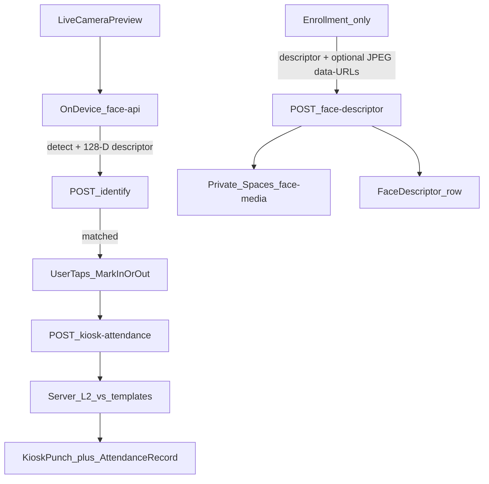
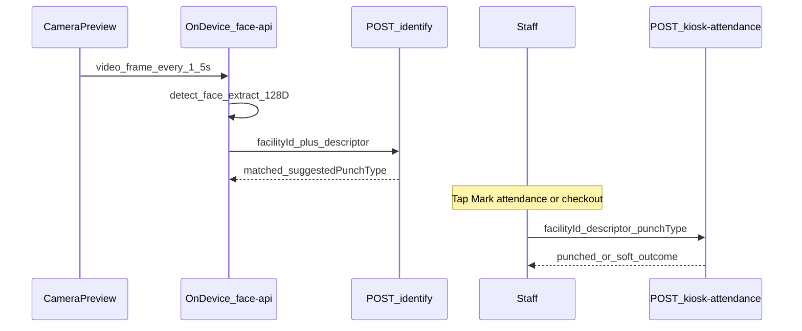
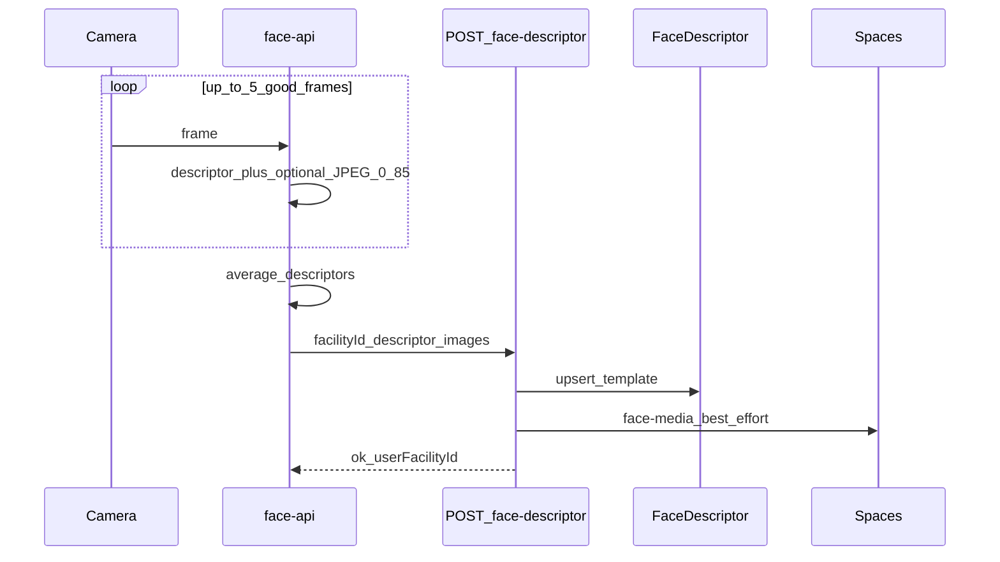
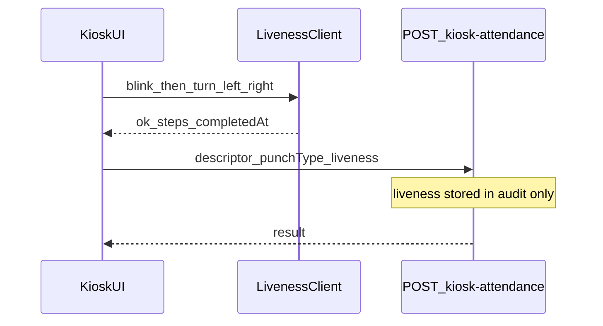

# Face Recognition Attendance — Implementation Guide

> **Status:** Source-traced analysis document (no invented behaviour).  
> **Audience:** Welbuk Care / tablet engineers reusing Practice APIs.  
> **Default tablet UX:** Navbar Attend Marker — live camera → identify every 1.5s → user confirms punch.  
> **Out of scope here:** Facility QR shower, staff QR scan sheet, Care UI code samples, API changes.

---

## Source of truth (do not invent behaviour)

| Layer | Path |
|--------|------|
| Navbar punch UI | `components/hrms/face-attendance-dialog.tsx` |
| Kiosk + liveness UI | `components/hrms/hrms-kiosk-face.tsx` |
| Enrollment UI | `components/hrms/face-registration-card.tsx` |
| Header mount | `components/shared/page-breadcrumbs-header.tsx` (`FaceAttendanceDialog`) |
| Identify API | `app/api/hrms/kiosk-attendance/identify/route.ts` |
| Punch API | `app/api/hrms/kiosk-attendance/route.ts` |
| Face template API | `app/api/hrms/face-descriptor/route.ts` |
| Alternate admin enroll | `app/api/facility/staff/route.ts` (`face0`–`face4`) |
| Match + auth | `lib/hrms/kiosk-face-match.ts` |
| Math / constants | `lib/hrms/face-math.ts` |
| Liveness (client) | `lib/hrms/face-liveness-client.ts` |
| Face media storage | `lib/hrms/face-media-storage.ts` |
| IP policy | `lib/hrms/attendance-ip-policy.ts` |
| Models loader | `lib/hrms/face-api-models.ts` (`public/models/`) |
| Cooldown config | `lib/site-config.ts` (`face_attendance_cooldown_sec`) |
| Schema | `FaceDescriptor`, `UserFaceMedia`, `KioskPunch`, `AttendanceRecord` in `prisma/schema.prisma` |

**Auth for tablet:** Practice staff JWT as `Authorization: Bearer <token>` (Care already does this). Identify/punch also accept `X-Kiosk-Secret` when `KIOSK_SECRET` is set. **No** `hrms.*` section permission on identify/punch — facility membership is enough.

---

## Critical facts (read first)

Tablet authors often assume “take a selfie and upload to a recognition cloud.” Practice does **not** do that on punch.

| Fact | Detail |
|------|--------|
| No third-party face cloud | Matching is local L2 in `face-math.ts` / `kiosk-face-match.ts` |
| `@vladmandic/face-api` runs **only on the client** | Weights from `public/models/` via `face-api-models.ts` |
| Punch sends **descriptor JSON only** — not an image | Navbar + punch route body |
| Match accept if L2 distance ≤ **0.45** | `DEFAULT_FACE_MATCH_THRESHOLD` |
| Descriptor dim **128** | `FACE_DESCRIPTOR_DIM` |
| Soft outcomes return **HTTP 200** | `matched:false`, `alreadyPunched`, `cooldown`, `ipBlocked` |
| “Today” date | `new Date().toISOString().slice(0, 10)` — **UTC** calendar day |
| No GPS / device-id / camera metadata in API payloads | Traced request bodies |
| Liveness is **client-only** | Server stores audit metadata; does **not** reject missing/failed liveness |
| Navbar skips liveness; kiosk enforces it before POST | Frontend asymmetry |
| Enroll images | JPEG data-URL quality **0.85**, max **5**, **5 MB** each → private Spaces `face-media/…` |
| Cooldown default | **30** s (`face_attendance_cooldown_sec`) |
| IP gate | Applies to clock-**in** only |



---

## 1. Functional overview

### Purpose

Staff clock **in** / **out** by face at a facility. Recognition runs on-device; the server only compares 128-D templates and writes attendance.

### Workflows

| Workflow | UI | Notes |
|----------|-----|--------|
| **Enrollment** (prerequisite) | `face-registration-card.tsx` | Capture frames → average descriptor → `POST /api/hrms/face-descriptor` (+ optional images) |
| **Navbar punch** (default tablet) | `face-attendance-dialog.tsx` | Live preview → identify every 1.5s → **confirm** → punch. No liveness. |
| **Kiosk wall** (appendix) | `hrms-kiosk-face.tsx` | Same punch API; client requires blink + head-turn before POST |

### Business rules (summary)

- Active `UserFacility` required to hold a template / punch.
- Explicit `punchType`: `"in"` \| `"out"` on punch (never inferred server-side from “toggle” alone — identify only *suggests*).
- Wrong punch relative to last punch → `alreadyPunched` (HTTP 200).
- Too soon after last punch → `cooldown` (HTTP 200).
- Clock-in from disallowed IP → `ipBlocked` (HTTP 200).
- Self enroll vs admin enroll (`targetUserFacilityId`) — see §4.

### Dependencies

- Client: `@vladmandic/face-api` + `public/models/` (ssdMobilenetv1, faceLandmark68, faceRecognitionNet).
- Server: Prisma, Spaces (face media), SiteConfig cooldown, facility IP allowlists.

### Permissions

- **Punch / identify:** facility member JWT **or** kiosk secret — not `hrms.attendance.*`.
- **Enroll self:** any employee with active `UserFacility`.
- **Enroll / check / delete other staff:** facility admin or super admin + `targetUserFacilityId`.

### Validations

- `descriptor` must be length **128**, all finite numbers.
- `punchType` required on punch.
- `threshold` optional; used only if `0 < threshold < 1`, else **0.45**.

---

## 2. End-to-end workflow

### 2.1 Navbar punch (primary Care target)

1. User taps ScanFace in sticky header → dialog opens.
2. Request camera permission; start **live front-camera video** (not ImagePicker).
3. Load face-api models from `/models` (origin of Practice).
4. Every **1500 ms**: `detectSingleFace` (minConfidence **0.45**) → landmarks → descriptor.
5. `POST /api/hrms/kiosk-attendance/identify` with `{ facilityId, descriptor }`.
6. If unmatched: keep looping; show “Face not recognised — look at the camera”.
7. If matched: **stop** identify loop; show name + **Mark attendance** / **Mark checkout**.
8. User taps CTA → `POST /api/hrms/kiosk-attendance` with same descriptor + `punchType`.
9. Handle soft outcomes (cooldown / alreadyPunched / ipBlocked) or success toast.
10. Resume identify loop (next person). Close dialog → stop camera tracks.

**There is no “image upload → recognition service” on punch.**

### 2.2 Enrollment (prerequisite)

1. Phase `idle` → `starting` (models + camera).
2. Phase `capturing`: up to 5 good frames (score ≥ 0.45, area ≥ 8000), JPEG quality 0.85.
3. Average descriptors on device.
4. Phase `saving`: `POST /api/hrms/face-descriptor` with averaged `descriptor` + optional `images[]`.
5. Server upserts `FaceDescriptor`; best-effort Spaces store for images.

### 2.3 Kiosk (appendix)

Same identify/punch APIs. Before punch POST, client runs blink → turn_left → turn_right (or cached renewal). Sends `liveness: { ok, steps, completedAt }` for audit only.

---

## 3. Backend architecture

- Next.js **route handlers** only (no separate controller layer).
- Helpers: `lib/hrms/*`.
- Auth: `authorizeKiosk` (secret **or** `requireFacilityPermission`).
- Match: `matchFaceAtFacility` loads active `FaceDescriptor` rows **and** `UserFaceMedia` rows that carry optional per-shot `descriptor`; picks nearest L2 across all candidates.
- `confidence` in API responses = **L2 distance** (lower is closer), not a similarity percentage.

---

## 4. API documentation

### 4.1 Face descriptor — `GET|POST|DELETE /api/hrms/face-descriptor`

**Auth:** staff JWT + facility permission. **Not** kiosk secret.

#### GET

Query: `facilityId` (required), `targetUserFacilityId?` (admin only).

```ts
type FaceDescriptorGetOk = {
  registered: boolean;
  registeredAt: string | null; // ISO
  noEmployeeProfile: boolean;
  faceImageUrl: string | null; // signed Spaces URL (~300s) for captureIndex 0
};
```

- Self = caller’s active `UserFacility`.
- Other staff: only facility/super admin; else **403**.
- No UF: `{ registered: false, registeredAt: null, noEmployeeProfile: true }`.

#### POST

```ts
type FaceDescriptorPostBody = {
  facilityId: string;
  descriptor: number[]; // length 128
  targetUserFacilityId?: string; // admin only
  images?: string[]; // data URLs or raw base64; max 5
  image?: string; // singular → [image]
  liveness?: { ok?: boolean; steps?: string[] }; // audit only
};

type FaceDescriptorPostOk = { ok: true; userFacilityId: string };
```

| Error | Status | Notes |
|-------|--------|--------|
| Bad JSON / missing facilityId / bad descriptor | **400** | descriptor message cites 128-element array |
| Self without UF | **400** | `{ code: "NO_EMPLOYEE_PROFILE" }` |
| Admin-for-other forbidden | **403** | |
| Target UF missing | **404** | |

Images: max **5**, each ≤ **5 MB**; path `face-media/{facilityId}/{userFacilityId}/{i}.{ext}`. Registration **succeeds** even if image store fails (best-effort).

#### DELETE

Query: `facilityId`, optional `targetUserFacilityId`. Soft-deletes `FaceDescriptor` only (does not clear all `UserFaceMedia`). Returns `{ ok: true }`.

---

### 4.2 Identify — `POST /api/hrms/kiosk-attendance/identify`

**Auth:** `authorizeKiosk` (JWT facility member **or** matching `X-Kiosk-Secret`).

```ts
type IdentifyBody = {
  facilityId: string;
  descriptor: number[]; // 128
  threshold?: number;   // else 0.45
};

// HTTP 200
type IdentifyNoTemplates = {
  matched: false;
  message: "No face templates registered for this facility";
};

type IdentifyNoMatch = {
  matched: false;
  confidence: number | null;
  threshold: number;
  message: "No matching employee";
};

type IdentifyMatched = {
  matched: true;
  staffName: string;
  userFacilityId: string;
  suggestedPunchType: "in" | "out";
  lastPunchType: "in" | "out" | null;
  confidence: number; // L2
  threshold: number;
};
```

`suggestedPunchType`: if no last punch today or last was `"out"` → `"in"`; else `"out"`.  
Last punch scoped to **UTC** `today` string.

Hard: **400** validation; **401/403/404** auth; **500**.

**Caller:** `face-attendance-dialog.tsx`, kiosk UI.

---

### 4.3 Punch — `POST /api/hrms/kiosk-attendance`

**Auth:** same as identify.

```ts
type KioskAttendanceBody = {
  facilityId: string;
  descriptor: number[]; // 128
  punchType: "in" | "out"; // required
  threshold?: number;
  liveness?: {
    ok?: boolean;
    steps?: string[];
    completedAt?: string | number;
  };
};
```

#### Soft outcomes (all HTTP **200**)

| Flags | Meaning |
|-------|---------|
| `matched: false` | No templates / no match (`message`, optional `confidence`) |
| `matched: true, alreadyPunched: true` | `in` while already in, or `out` while not in |
| `matched: true, cooldown: true` | `cooldownRemainingSec`, message `Please wait ${n}s…` |
| `matched: true, ipBlocked: true` | Clock-**in** only; `code: "ATTENDANCE_IP_NOT_ALLOWED"`, `clientIp`, `inOffice` |

Already-punched copy (server):

- In while in: `"You are already clocked in. Use Mark checkout when leaving."`
- Out while out/absent: `"You are not clocked in yet. Use Mark attendance first."`

#### Success (HTTP **200**)

```ts
type PunchSuccess = {
  matched: true;
  staffName: string;
  userFacilityId: string;
  punchType: "in" | "out";
  confidence: number;
  threshold: number;
  at: string; // ISO
};
```

#### Processing order

1. Validate JSON / descriptor / `punchType`.
2. Authorize + match face.
3. Soft unmatched.
4. `alreadyPunched` vs last punch today (UTC).
5. `cooldown` if SiteConfig seconds &gt; 0 and elapsed &lt; cooldown.
6. `ipBlocked` **only if** `punchType === "in"` and IP policy fails.
7. Transaction: create `KioskPunch` + create/update `AttendanceRecord`.

#### AttendanceRecord updates (transaction)

- No row → create `PRESENT`; set `clockIn` / `clockOut` (+ IPs) from punch type.
- `in` without `clockOut`: set `clockIn` if missing.
- `in` with existing `clockOut`: new cycle — `clockIn=now`, clear `clockOut` / `totalHours`.
- `out` with `clockIn` and no `clockOut`:

```ts
totalHours = Math.round(((now - clockInMs) / 3_600_000) * 100) / 100;
```

- `out` without `clockIn`: set both to `now` (no `totalHours`).

`KioskPunch`: `type`, `time`, `date` (UTC ymd), `confidence`, `source: "face"`, `clientIp`.

**Caller:** navbar dialog (no `liveness`); kiosk (with `liveness`).

---

### 4.4 Alternate admin enroll — `POST /api/facility/staff` (multipart)

When any face file present: exactly **5** files `face0`…`face4` and **5** JSON descriptors `descriptor0`…`descriptor4`.  
Types jpeg/png/webp; 1 byte…5 MB. Spaces path `uploads/kiosk/faces/{userFacilityId}/…`. Averaged → `FaceDescriptor` upsert + per-index `UserFaceMedia`. Requires Spaces configured.

---

## 5. Face recognition process

| Step | Detail |
|------|--------|
| Capture loop | Live `<video>` / RN equivalent; sample every **1500 ms** |
| JPEG | **Enrollment only** (quality 0.85); punch never uploads frames |
| Detect | `detectSingleFace` + `SsdMobilenetv1Options({ minConfidence: 0.45 })` (UI); liveness uses **0.35** |
| Embed | Landmarks → faceRecognitionNet → **128-D** Float32 |
| Multi-face | `detectSingleFace` — single face only |
| Server match | Nearest L2 ≤ threshold (default 0.45) |
| Liveness | EAR blink + nose yaw ratios (`face-liveness-client.ts`); **no** dedicated spoof model |
| Models URI | `{origin}/models` (ssd + landmark68 + recognition) |

---

## 6. Attendance logic

| Rule | Behaviour |
|------|-----------|
| Punch type | Explicit `"in"` \| `"out"` from client |
| alreadyPunched | Block redundant in/out vs last punch **today (UTC)** |
| Cooldown | After any successful punch; default 30s |
| IP | Gate on **in** only via office/remote allowlists |
| Date key | UTC `YYYY-MM-DD` |
| Hours | Round to 2 decimals between clockIn and clockOut |
| GPS | Not used |

---

## 7. Data flow

### Mandatory vs optional

| Field | Identify | Punch | Enroll |
|-------|----------|-------|--------|
| `facilityId` | required | required | required |
| `descriptor[128]` | required | required | required |
| `punchType` | — | required | — |
| `threshold` | optional | optional | — |
| `liveness` | — | optional (kiosk) | optional audit |
| `images` / `image` | — | — | optional |
| `targetUserFacilityId` | — | — | optional admin |

### Explicitly **not** sent

- Employee `userId` (resolved by face match)
- `deviceId`, GPS, camera EXIF
- Punch JPEG / video blob

---

## 8. Database flow

| Model | Role |
|-------|------|
| `FaceDescriptor` | Averaged template per `UserFacility` (soft-delete supported) |
| `UserFaceMedia` | Optional per-shot image + descriptor (enroll / staff multipart) |
| `KioskPunch` | Each face punch event |
| `AttendanceRecord` | Day row: PRESENT, clockIn/Out, totalHours, IPs |

Relation hub: **`UserFacility`**.

---

## 9. Error handling

| Situation | Client UX | API |
|-----------|-----------|-----|
| No face in frame | “Look at the camera…” | No request / ignore |
| Not recognised | “Face not recognised — look at the camera” | 200 `matched:false` |
| Camera denied | Inline error | — |
| Network / 5xx | Toast / inline | non-200 `{ error }` |
| Cooldown | Amber wait message | 200 `cooldown:true` |
| Already punched | Amber message | 200 `alreadyPunched:true` |
| IP blocked | Destructive message | 200 `ipBlocked:true` |
| No employee profile (enroll) | Error | 400 `NO_EMPLOYEE_PROFILE` |
| Invalid descriptor | Error | 400 |
| Identify transient errors | **Swallowed** — loop continues | — |

---

## 10. State management

### Navbar dialog phases

`closed` → `opening` → `loadingModels` / `startingCamera` → `identifying` → `identified` → `punching` → `success|fail` → resume `identifying` or `Not you? Scan again`.

### Registration phases

`idle` | `starting` | `capturing` | `saving`.

### Kiosk

Adds liveness gates before punch; may cache session liveness briefly.

---

## 11. Security

- Auth: Bearer JWT **or** `X-Kiosk-Secret`.
- Face media: private AES256 Spaces; signed URLs on GET status.
- Descriptors are **biometric templates** — treat as sensitive; do not log full vectors in client analytics.
- Audits: `writeHrmsAuditSafe` (attempt / match / upsert).
- Punch response may include `staffName` — not patient PHI.
- Liveness metadata is advisory only on the server.

---

## 12. React Native tablet implementation guide

**First RN pitfall — `Cannot read properties of undefined (reading 'getUserMedia')`:**

Practice web opens the camera with `navigator.mediaDevices.getUserMedia` (`hooks/use-camera-devices.ts`). In React Native, `navigator.mediaDevices` is **undefined** (browser-only). Porting web face/QR scanner code into Care throws exactly this error.

**Second RN pitfall — multi-photo / `takePictureAsync` burst:**

Practice punch runs `detectSingleFace(video)` on the **live stream** every **1500 ms**. It does **not** take N photos then identify. Enrollment may average frames; punch never batches photos.

| Do | Don’t |
|----|--------|
| Continuous live preview (`expo-camera` / vision-camera) | `getUserMedia` / html5-qrcode in RN |
| Every **1500 ms**: sample **current preview frame in memory** (preview snapshot — not gallery) | `takePictureAsync` shutter burst / ImagePicker |
| One frame → one `POST /identify` `{ facilityId, descriptor[128] }` | Upload JPEG / multipart on punch |
| Confirm CTA → `POST /kiosk-attendance` | Auto-punch / 3–5 photos before identify |
| Soft HTTP 200 flags | Invent client-side gallery matching |
| Load `{practiceUrl}/models` (same face-api space) | Custom / cloud face APIs |

**Care pattern:** live `CameraView` + silent in-memory preview capture (`react-native-view-shot`) → hidden face-api WebView → identify → confirm. Zero photos uploaded on punch.

**Header:** Attend action before Facility QR.  
**State machine:** mirror §10 navbar phases.  
**Enrollment:** on Practice (or future Care enroll via face-descriptor API).  
**Kiosk mode:** optional; same punch API + client liveness appendix.

---

## 13. Sequence diagrams

### (a) Navbar punch



### (b) Enrollment



### (c) Kiosk + liveness (optional)



---

## Care acceptance checklist

- [ ] Camera permission + **live** preview (not ImagePicker)
- [ ] On-device face-api models from Practice `/models` (same 128-D space)
- [ ] Identify poll ≈ 1500 ms; pause on match
- [ ] Confirm-then-punch (no navbar auto-punch)
- [ ] Punch body: `facilityId`, `descriptor[128]`, `punchType` only (+ optional threshold)
- [ ] Soft 200: unmatched, `alreadyPunched`, `cooldown`, `ipBlocked`
- [ ] Bearer JWT; hide Attend without `facilityId`
- [ ] Stop camera on dialog close
- [ ] Staff enrolled via Practice face registration before punch works
- [ ] Copy aligned: Look at the camera… / Mark attendance / Mark checkout / Not you? Scan again

---

## Constants quick reference

| Constant | Value |
|----------|--------|
| `FACE_DESCRIPTOR_DIM` | `128` |
| `DEFAULT_FACE_MATCH_THRESHOLD` | `0.45` |
| `DEFAULT_FACE_ATTENDANCE_COOLDOWN_SEC` | `30` |
| `IDENTIFY_INTERVAL_MS` | `1500` |
| Detect `minConfidence` (punch UI) | `0.45` |
| Detect `minConfidence` (liveness) | `0.35` |
| Enroll JPEG quality | `0.85` |
| Max enroll images | `5` × 5 MB |
