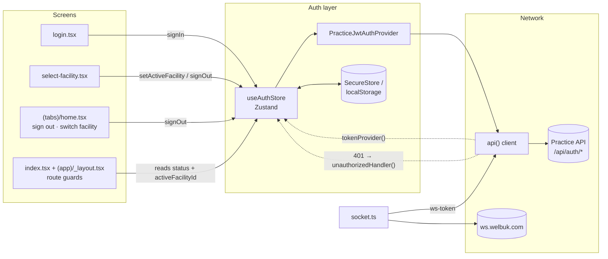
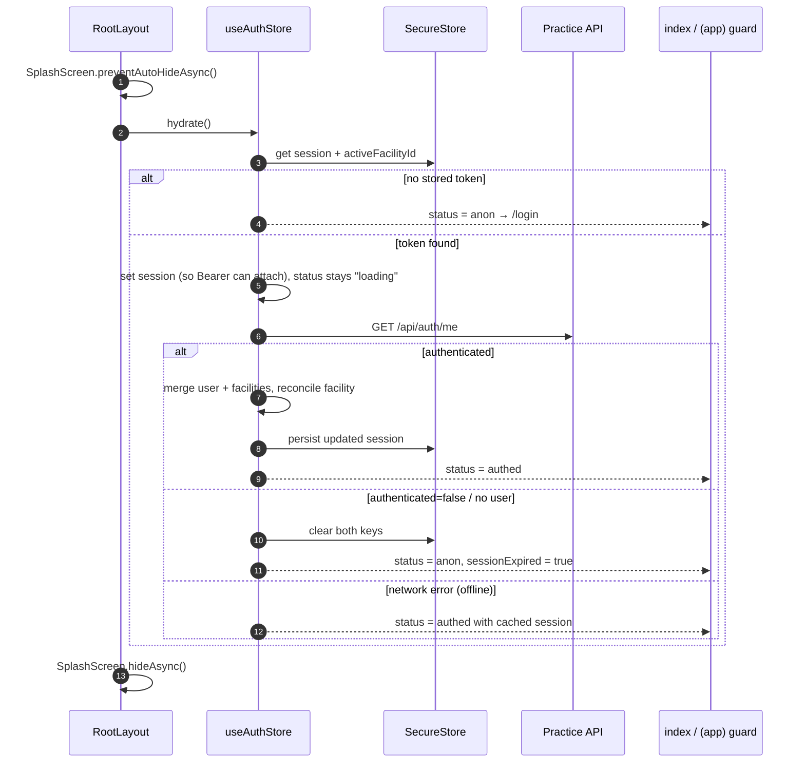
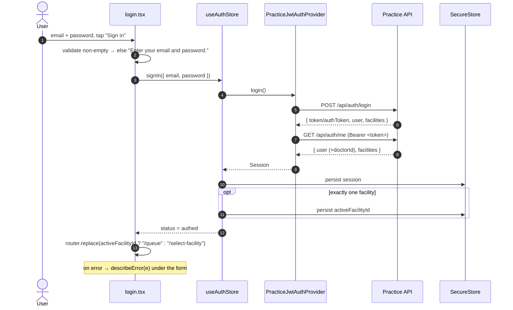
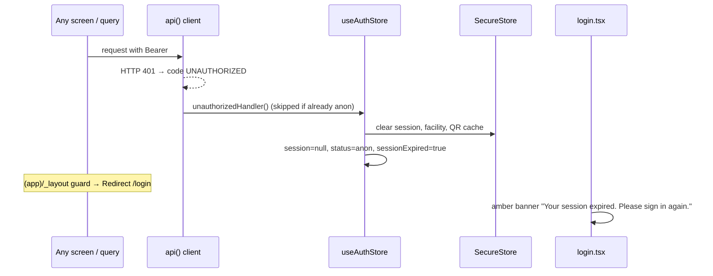

# Care authentication flow — end-to-end guide

> **Status:** Implemented (v1: Practice JWT).  
> **Scope:** The API contract (endpoints, request/response data, errors, tokens) **and** the local side (store, secure storage, routing guards, screens, UI components, design).  
> **Future:** Welbuk Identity (OIDC) replaces `PracticeJwtAuthProvider` behind the `AuthProvider` seam. The store and screens stay the same.

---

## 1. Overview

- Care signs in against the **Welbuk Practice API** with email + password.
- Practice returns a **7-day HS256 bearer JWT**. There is **no refresh token**. An expired token surfaces as a `401`, which forces a re-login.
- Right after login, Care calls **`GET /api/auth/me`**. The login `user` payload has **no `doctorId`**, and `/me` is the authoritative source for roles and facilities.
- A session is only usable once a **facility is selected** (`activeFacilityId`). Every clinical API call is facility-scoped.
- Realtime (socket.io on `ws.welbuk.com`) uses a separate **1-hour facility-scoped WS token** fetched with the session JWT.

### Key files

| Layer | File | Responsibility |
|---|---|---|
| API endpoints | [`src/lib/api/endpoints/auth.ts`](../../src/lib/api/endpoints/auth.ts) | `loginRequest`, `fetchMe`, `fetchWsToken`, `logoutRequest` |
| HTTP client | [`src/lib/api/client.ts`](../../src/lib/api/client.ts) | Bearer injection, `skipAuth` / `skipAuthRedirect`, global 401 handler |
| Errors | [`src/lib/api/errors.ts`](../../src/lib/api/errors.ts) | `ApiError`, `mapErrorCode`, `describeError` |
| Config | [`src/lib/config.ts`](../../src/lib/config.ts) | `practiceUrl`, `wsUrl` from `EXPO_PUBLIC_*` |
| Types + seam | [`src/lib/auth/types.ts`](../../src/lib/auth/types.ts) | `AuthUser`, `Facility`, `Session`, `LoginInput`, `AuthProvider` |
| Provider | [`src/lib/auth/practice-provider.ts`](../../src/lib/auth/practice-provider.ts) | `PracticeJwtAuthProvider` (v1) |
| Store | [`src/lib/auth/store.ts`](../../src/lib/auth/store.ts) | Zustand `useAuthStore`, selectors, client wiring |
| Persistence | [`src/lib/auth/secure-storage.ts`](../../src/lib/auth/secure-storage.ts) | SecureStore (native) / localStorage (web) |
| Roles | [`src/lib/auth/roles.ts`](../../src/lib/auth/roles.ts) | `isDoctorHome`, `isDoctorRole`, greeting helpers |
| Realtime | [`src/lib/realtime/socket.ts`](../../src/lib/realtime/socket.ts) | WS token handshake + re-fetch on expiry |
| Root layout | [`src/app/_layout.tsx`](../../src/app/_layout.tsx) | Holds the splash screen, runs `hydrate()` |
| Boot gate | [`src/app/index.tsx`](../../src/app/index.tsx) | `/` → login / select-facility / queue |
| App guard | [`src/app/(app)/_layout.tsx`](../../src/app/(app)/_layout.tsx) | Protects every authenticated route |
| Screens | [`src/app/login.tsx`](../../src/app/login.tsx), [`src/app/select-facility.tsx`](../../src/app/select-facility.tsx) | Sign-in UI, facility picker |

---

## 2. Architecture



At module load, `store.ts` registers two hooks on the HTTP client:

- `setTokenProvider(() => authProvider.resolveToken(session))` attaches `Authorization: Bearer <token>` to every request unless it sets `skipAuth`.
- `setUnauthorizedHandler(...)` runs on any `401` unless the request sets `skipAuthRedirect`. It clears the session and flags `sessionExpired`.

---

## 3. API contract

### 3.1 Base URLs

| Env var | Default | Used for |
|---|---|---|
| `EXPO_PUBLIC_PRACTICE_URL` | `http://localhost:3005` | All `/api/*` calls (trailing slash stripped) |
| `EXPO_PUBLIC_WS_URL` | `https://ws.welbuk.com` | socket.io realtime |

> A physical device can't reach `localhost`. Use the machine's LAN IP or the staging origin.

Every request sends `Accept: application/json`. JSON bodies add `Content-Type: application/json`, and `FormData` bodies let `fetch` set the multipart boundary.

### 3.2 Endpoints

| # | Method & path | Auth | Client flags | Called from |
|---|---|---|---|---|
| 1 | `POST /api/auth/login` | none | `skipAuth`, `skipAuthRedirect` | `loginRequest` ← `authProvider.login` ← `signIn` |
| 2 | `GET /api/auth/me` | Bearer | after login: explicit header + `skipAuth`, `skipAuthRedirect`; otherwise the default | `loginRequest`, `hydrate`, `refreshFacilities` |
| 3 | `GET /api/auth/ws-token?facilityId=` | Bearer | default | `createRealtime` (socket.ts) |
| 4 | `POST /api/auth/logout` | Bearer | `skipAuthRedirect` | `authProvider.logout` ← `signOut` |
| – | `GET /api/getVersion?appType=care` | none | `skipAuth` | `UpdateVersionAlert` in root layout (runs before auth, never blocks it) |

#### 1. `POST /api/auth/login`

Request:

```json
{ "email": "doctor@clinic.com", "password": "••••••••" }
```

`email` is trimmed and `password` is sent unchanged.

Response (`LoginResponse`):

```json
{
  "message": "Login successful",
  "token": "<jwt>",
  "authToken": "<jwt>",
  "user": { "id": "…", "email": "…", "name": "…", "role": "USER" },
  "facilities": [{ "id": "665f…", "facilityId": 1024, "name": "City Clinic", "address": "…" }]
}
```

- The token is `authToken ?? token`. If neither is present, login throws `"Login succeeded but no token was returned."`
- `user` here has **no `doctorId`**, so Care immediately calls `/me` (next endpoint).
- A `401` for bad credentials does **not** fire the global handler (`skipAuthRedirect`). The message goes back to the login form.

#### 2. `GET /api/auth/me`

Response (`MeResponse`):

```json
{
  "authenticated": true,
  "user": {
    "id": "…", "email": "…", "name": "Asha Rao", "displayName": null,
    "role": "user", "globalRole": "user",
    "doctorId": "66a1…",
    "roles": ["doctor"], "roleLabels": ["Doctor"],
    "rolesByFacility": { "665f…": ["Doctor"] }
  },
  "facilities": [{ "id": "665f…", "name": "City Clinic", "consultationType": "dental", "networkBlocked": false }]
}
```

How each caller handles `/me`:

| Caller | Success | `authenticated: false` or no `user` | Throws |
|---|---|---|---|
| `loginRequest` (explicit Bearer) | session = `{ token, me.user, me.facilities ?? login.facilities }` | falls back to the login payload | logs, falls back to the login payload |
| `hydrate` | replaces cached `user` + `facilities`, persists | clears storage → `anon` + `sessionExpired: true` | **offline fallback**: uses the cached session as `authed` |
| `refreshFacilities` | replaces `user` + `facilities`, persists | no-op | no-op (keeps the cached list) |

#### 3. `GET /api/auth/ws-token?facilityId=<id>`

Response: `{ "token": "<ws-jwt>" }`, valid for 1 hour and scoped to one facility. The WS server joins the socket to room `facility:<id>` from the token claims. See [§5.6](#56-realtime-ws-token-handshake).

#### 4. `POST /api/auth/logout`

Best effort. Errors are swallowed, and the client clears local state regardless.

### 3.3 Data types (`src/lib/auth/types.ts`)

**`AuthUser`**

| Field | Type | Notes |
|---|---|---|
| `id` | `string` | |
| `email` | `string` | |
| `name` | `string` | Greeting source |
| `role` | `GlobalRole` | Primary slug; may be a stale JWT copy |
| `globalRole?` | `GlobalRole \| null` | **Authoritative** tier (`user` / `facility_admin` / `super_admin`) |
| `displayName?` | `string \| null` | |
| `image?` | `string \| null` | |
| `doctorId?` | `string \| null` | Linked clinical Doctor.id, **only from `/me`** |
| `roles?`, `roleLabels?` | `string[]` | |
| `rolesByFacility?` | `Record<facilityId, string[]>` | |

**`Facility`**

| Field | Type | Notes |
|---|---|---|
| `id` | `string` | Mongo ObjectId, the `facilityId` passed to APIs |
| `facilityId?` | `number \| string` | Public numeric id (display only) |
| `name` | `string` | |
| `address?`, `type?` | `string \| null` | |
| `consultationType?` | `string \| null` | `dental` / `eye` / `general`; picks the consult sub-flow |
| `networkBlocked?` | `boolean` | Device IP not on the facility allowlist; the row is disabled in the picker |

**`Session`** = `{ token: string; user: AuthUser; facilities: Facility[] }`  
**`LoginInput`** = `{ email: string; password: string }`

**`AuthProvider`** (the seam):

```ts
interface AuthProvider {
  readonly id: string;                                 // "practice-jwt"
  login(input: LoginInput): Promise<Session>;
  logout(session: Session | null): Promise<void>;
  resolveToken(session: Session | null): Promise<string | null>; // no refresh in v1
}
```

### 3.4 Error mapping (`src/lib/api/errors.ts`)

Every non-2xx response becomes an `ApiError { status, code, serverCode, data }`. A `fetch` failure becomes `code: "NETWORK"` with `status: 0`.

| HTTP / condition | `code` | Auth effect |
|---|---|---|
| `401` | `UNAUTHORIZED` | Fires `unauthorizedHandler` (unless `skipAuthRedirect`) → forced sign-out |
| `403` with message containing network/ip/allowlist | `IP_BLOCKED` | none; facility is off the allowed network |
| `403` other | `FORBIDDEN` | none |
| `404` / `409` / `400` | `NOT_FOUND` / `CONFLICT` / `VALIDATION` | none |
| fetch threw | `NETWORK` | none |
| else | `HTTP` | none |

The server message is read from `error` or `message` in the JSON body. `describeError()` turns it into safe UI text and never shows native or stack-trace strings.

---

## 4. Local state & storage

### 4.1 `useAuthStore` (Zustand)

| State | Type | Meaning |
|---|---|---|
| `status` | `"loading" \| "authed" \| "anon"` | Starts as `loading` until `hydrate()` finishes |
| `session` | `Session \| null` | Token + user + facilities |
| `activeFacilityId` | `string \| null` | Selected `Facility.id` |
| `sessionExpired` | `boolean` | Set when a 401 or a failed `/me` forced sign-out; drives the login banner |

| Action | What it does |
|---|---|
| `hydrate()` | Restore from storage → validate with `/me` → reconcile the facility (see §5.1) |
| `signIn(input)` | `authProvider.login` → persist session → auto-select if exactly **one** facility → `authed` |
| `signOut()` | `authProvider.logout` (best effort) → clear session, facility, QR cache → `anon` |
| `setActiveFacility(id)` | Persist + set `activeFacilityId` |
| `refreshFacilities()` | Re-run `/me` and update `user` + `facilities` (non-fatal) |

Selectors: `useActiveFacility()`, `useFacilityId()`, `useAuthUser()`, `useDoctorId()`.

### 4.2 Persistence (`secure-storage.ts`)

| Key | Value | Wrapper |
|---|---|---|
| `welbuk_care_session` | JSON `Session` (includes the JWT) | `sessionStorage.get/set/clear` |
| `welbuk_care_active_facility` | plain `Facility.id` string | `activeFacilityStorage.get/set/clear` |

- **Native:** `expo-secure-store` (iOS Keychain / Android Keystore).
- **Web:** `localStorage` fallback, because SecureStore isn't available there.
- Corrupt JSON is deleted on read, which sends the user back to anon.
- Sign-out and 401 also clear the facility QR cache (`clearFacilityQrCache`, `src/features/header/facilityQrCache.ts`).

---

## 5. Flows

### 5.1 Cold start / hydrate



**Facility reconciliation.** If the stored `activeFacilityId` is no longer in the `/me` facilities, it is replaced by the only facility when exactly one exists, and cleared otherwise (the user then lands on `/select-facility`).

**Why stay in `loading` until `/me` returns:** doctor sessions need `doctorId` to scope appointments. Rendering first would briefly show facility-wide data.

### 5.2 Login



If the login screen is opened while already `authed`, it redirects straight to `/queue` or `/select-facility`.

### 5.3 Facility selection / switching

- **First time** (no facility yet): the full-screen "Choose a facility" list. Tapping a row calls `setActiveFacility(id)` then `router.replace("/queue")`.
- **Switching** (Home → "Switch facility" → `router.push("/select-facility")`): shows a `TopBar` titled "Switch facility" with the current facility as subtitle and a Back label. Choosing a row calls `router.back()`.
- Rows with `networkBlocked` are disabled and dimmed, with the message *"This device isn't on an allowed network for this facility."*
- No facilities: *"No facilities are linked to your account. Contact your administrator."*
- `status === "anon"` redirects to `/login`.

### 5.4 Session expiry (401)



The 7-day JWT has no refresh, so this path is the normal way an expired token ends up back at login.

### 5.5 Sign out

1. The user taps **Sign out**: the ghost button on `select-facility.tsx`, or the menu row on `(tabs)/home.tsx`.
2. A confirmation `Alert` appears: title *"Sign out?"*, message *"You'll need to sign in again to use the app."*, with Cancel and destructive Sign out. Home uses i18n keys `common.signOutConfirmTitle`, `common.signOutConfirmMessage`, `common.signOut`, `common.cancel` (English + Tamil).
3. `signOut()` calls `POST /api/auth/logout` (best effort), clears both storage keys and the facility QR cache, then sets `status = anon` with `sessionExpired = false`, so no banner appears.
4. The guards redirect to `/login`.

### 5.6 Realtime WS token handshake

`useRealtime()` runs in `(app)/_layout.tsx` and does nothing until a facility is set. `createRealtime(facilityId)`:

1. `GET /api/auth/ws-token?facilityId=` → token → `socket.connect()` with `auth: { token }` (websocket transport, infinite reconnect with 2–30 s backoff).
2. On a `connect_error` containing `AUTH_TOKEN_EXPIRED` or `AUTH_MISSING_TOKEN`, it fetches a new WS token and reconnects.
3. If the ws-token call itself returns 401, the normal §5.4 path signs the user out.

---

## 6. Routing guards

| Where | Check | Result |
|---|---|---|
| `src/app/_layout.tsx` | mount | `hydrate()`, then hide the splash |
| `src/app/index.tsx` (`/`) | `loading` | "W" brand tile + spinner |
| | `anon` | → `/login` |
| | `authed`, no facility | → `/select-facility` |
| | `authed` + facility | → `/queue` |
| `src/app/(app)/_layout.tsx` (every authenticated route) | `loading` | centered spinner |
| | `anon` | → `/login` |
| | no facility | → `/select-facility` |
| | ok | `OfflineBanner` + `Stack` + `RealtimeToastHost` |
| `src/app/login.tsx` | `authed` | → `/queue` or `/select-facility` |
| `src/app/select-facility.tsx` | `anon` | → `/login` |

---

## 7. Roles derived from the session (`src/lib/auth/roles.ts`)

Always prefer `/me` fields. JWT `role` is a stale copy.

| Helper | Rule |
|---|---|
| `getGlobalRoleLower` | `(globalRole ?? role).toLowerCase()` |
| `isSuperAdminUser` / `isFacilityAdminUser` | `super_admin` / `facility_admin` |
| `isDoctorHome` | `doctorId` present **and** not super/facility admin. These users must pass `doctorId` on appointment APIs |
| `isDoctorRole` | not an admin, and (`doctorId` or any role key == `doctor`) |
| `isNurseRole` | not a doctor, and a role key of `nurse`, `nurse_*` or `*_nurse` |
| `userDisplayName` | `name` → `displayName` → email local-part |
| `userGreetingName` | `"Dr. <name>"` only for doctors (strips an existing "Dr." prefix) |

Role keys are gathered from `role`, `roles`, `roleLabels` and `rolesByFacility`, normalised to lower snake_case.

---

## 8. UI design & components

**Brand:** magenta `#FD006A` (`brand` in `tailwind.config.js`, identical to Practice `--brand`). Styling uses NativeWind classes.

### 8.1 Login screen (`src/app/login.tsx`)

```
┌──────────────────────────────┐
│   bg-brand header (pt-9)     │
│      [auth-header-icon]      │  112×112, assets/images/auth-header-icon.png
│        Welbuk Care           │  text-3xl bold white
│ Sign in to your clinic account│  text-sm white/85
├──────────────────────────────┤  white card, -mt-5 rounded-t-3xl, max-w-md
│ ⚠ Your session expired…      │  amber-50 banner (only if sessionExpired)
│ Welcome back                 │  text-xl semibold
│ Enter your credentials…      │  text-sm neutral-500
│ Email     [you@clinic.com  ] │  TextField
│ Password  [••••••••     👁 ] │  TextField + eye toggle (rightAccessory)
│ <error text, red-500>        │
│ [        Sign in         ]   │  Button primary lg, spinner while loading
└──────────────────────────────┘
```

- Wrapped in `Screen` (`bg-white`, edges left/right/bottom), then `KeyboardAvoidingView` (`padding` on iOS) and a `ScrollView` (`keyboardShouldPersistTaps="handled"`, no bounce).
- Email field: `keyboardType="email-address"`, `autoCapitalize="none"`, `autoComplete="email"`.
- Password field: `secureTextEntry` toggled by an `Ionicons` `eye-outline` / `eye-off-outline` button with an accessibility label. The keyboard's return key ("go") submits.

### 8.2 Select facility (`src/app/select-facility.tsx`)

- `Screen bg-white`, a `ScrollView` with 16 px gutters, and content capped at `max-w-6xl` (1152 px) for tablets.
- Heading: "Choose a facility" plus the helper line, or `TopBar` "Switch facility" (subtitle = current facility, `backLabel="Back"`) when switching.
- The list is a rounded-2xl bordered card. Each row has:
  - a 40 px round avatar (`bg-brand/10`) with the `business-outline` icon
  - the name (semibold) and address (2 lines max)
  - a trailing `checkmark-circle` (selected) or `chevron-forward`
  - selected row: `bg-brand/5`; blocked row: `bg-neutral-50 opacity-60` plus the red helper text
- A ghost `Button` "Sign out" at the bottom opens the confirmation.

### 8.3 Loading states

- `/` boot gate: a 64 px `bg-brand` rounded tile with a white "W", plus a brand-coloured `ActivityIndicator`.
- `(app)` guard: a centered brand `ActivityIndicator` on white.
- A native splash screen stays up until `hydrate()` resolves.

### 8.4 Shared components (`src/ui/`)

| Component | Used for | Relevant props |
|---|---|---|
| `Screen` | Safe-area page shell | `bgClassName`, `edges` (top handled by the brand status-bar fill) |
| `TextField` | Email / password | `label`, `error`, `rightAccessory`; border `neutral-300` → `brand` on focus → `red-400` on error |
| `Button` | Sign in / Sign out | `variant`: `primary \| outline \| ghost \| danger`; `size`: `md \| lg`; `loading` |
| `TopBar` | "Switch facility" header | `title`, `subtitle`, `backLabel` |
| `AppModal` | Update-version prompt shown pre-auth in root layout | `visible`, `onRequestClose` |
| `OfflineBanner`, `RealtimeToastHost` | Mounted by the `(app)` guard after auth | none |

---

## 9. Messages shown to the user

| Situation | Message |
|---|---|
| Empty email/password | Enter your email and password. |
| Wrong credentials | Server `error`/`message` text (e.g. "Invalid credentials"), cleaned by `describeError` |
| Forced sign-out (401 / `/me` rejects) | Your session expired. Please sign in again. (banner) |
| Offline | No connection. Check your network and try again. |
| Facility IP-blocked (403) | This device isn't on an allowed clinic network for this facility. |
| Login OK but no token | Login succeeded but no token was returned. |
| Anything technical / unknown | Something went wrong. Please try again. |

---

## 10. Edge cases & notes

- **No refresh token.** After 7 days the next call returns 401 and the user is sent to login with the banner.
- **`doctorId` only comes from `/me`.** If `/me` fails right after login, the session falls back to the login user without `doctorId` until the next `hydrate`/`refreshFacilities`.
- **Offline cold start** keeps the user signed in with cached data; it doesn't sign them out.
- **Stale facility** (removed from the account) is reconciled on hydrate.
- **Logout is best effort.** Local state is always cleared even if the server call fails.
- **Login's own 401 never triggers the global handler** (`skipAuthRedirect`), so a wrong password doesn't show the "session expired" banner.
- **OIDC migration:** implement `AuthProvider` (`WelbukIdentityOidcProvider`) with a real `resolveToken` refresh and swap the `authProvider` export in `practice-provider.ts`. The store, guards and screens stay the same.
